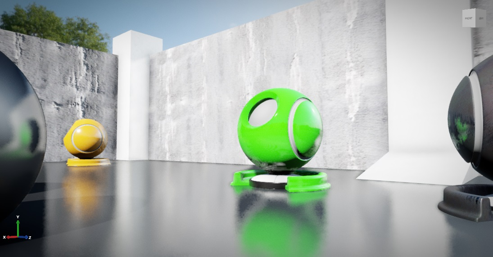
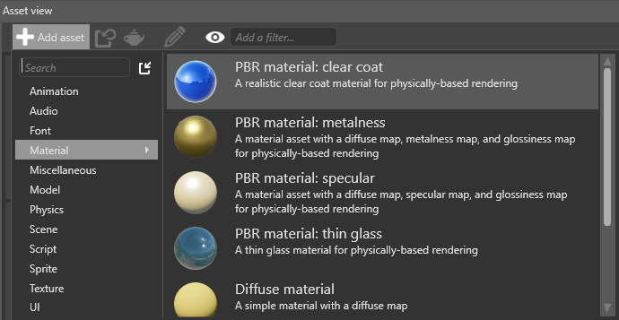
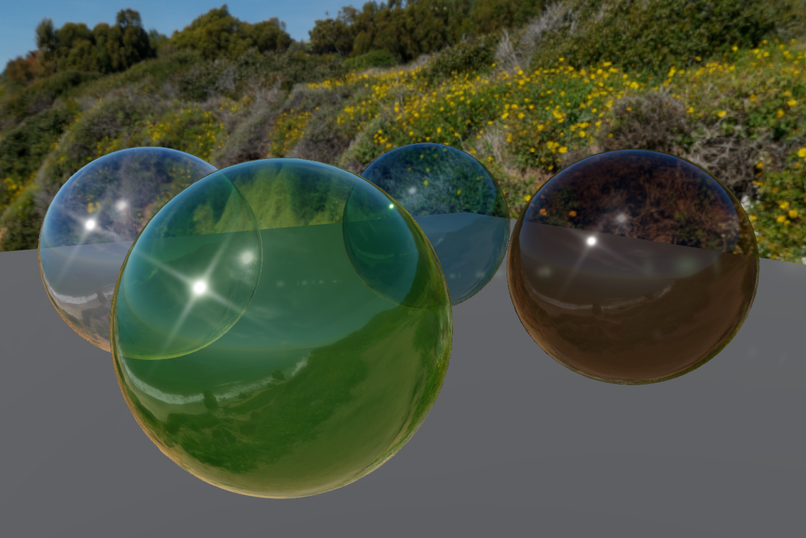
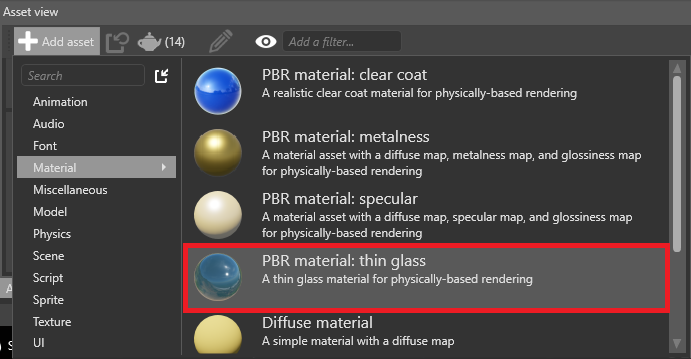
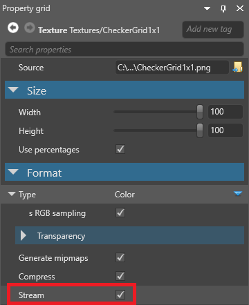
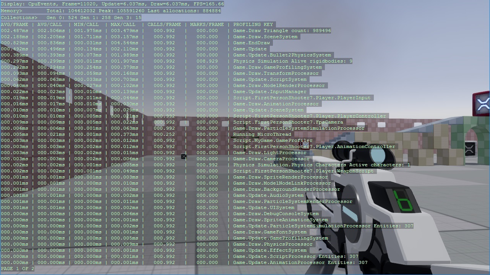

# Xenko 2.1 release notes

## Highlights

### Local reflections

Xenko 2.1 introduces **local reflections**. When you enable this post effect, the scene is reflected in glossy [materials](../materials/index.md).

You can enable and customize local reflections in the graphics compositor on the **post effects** properties.

For details, see [Local reflections](.../manual/graphics/local-reflections.md).

### Clear coat shading

Xenko 2.1 includes a **clear-coat material** template that uses physically-based rendering to simulate vehicle paint.

Clear-coat shading has several advantages over creating the effect manually with material layers:

* layers are blended based on distance
* increased performance
* improved visualization

You can add a predefined **clear coat** material from the **Asset view** under **Add asset > Material**.

For details, see [Clear coat shading](../manual/graphics/materials/clear-coat-shading.md).

### Thin glass materials

You can now render thin glass materials such as windshields. The diffuse color controls the tint of the glass and how much light is blocked (darker colors block more light).

You can add a predefined **Glass** material from the **Asset view** under **Add asset > Material**.

### Improved light shafts

You can now use **light shafts** with any kind of light that casts shadows (ie point lights, directional lights, or spot lights). You can also use them with multiple shadow cascades.

Additionally, Game Studio now displays light shaft bounding volumes in the scene editor, so you can easily see the areas where light shafts are created. To show or hide navigation light shaft bounding volumes, in the **scene editor toolbar**, open the **gizmo options** menu and use the **Light shaft bounding volumes** checkbox.

The `LightShaftComponent` settings have been simplified and now have settings to control quality and performance.

For details, see [Light shafts](.../manual/graphics/lights-and-shadows/light-shafts.md).

### Texture streaming

Xenko now supports streaming for textures. This significantly decreases the time it takes to load a game or scene, uses less memory, and makes your game easier to scale.

You can also set the global **Streaming** settings in the game settings.

Future versions will let you stream other types of content.

### Render masks

You can now set which render groups a camera renders under **Graphics Compositor > Entry points > Render masks**.

### Improved profiler

The **Game Profiler** script now displays more information and is easier to use.

You can now:

* profile GPU information
* switch between CPU, GPU, and FPS-only results with **F1**
* sort the result pages by **Name** or **Time** with **F2**
* change how frequently the profiler gets and displays new results with **- / +**
* jump to a results page with the **number keys**, or move forward and backwards with **F3** and **F4**
* set parameters in Game Studio:
    
    

For details, see [Profiling](.../manual/troubleshooting/profiling.md).

### Rewritten input system

The input system has been rewritten to track different input devices and allow for better extensibility.

* Allows detection of added/removed devices through events on the InputManager
* New device interfaces such as `IMouseDevice`, `IKeyboardDevice`, `IGameController`
* High-level `IGamePadDevice` replaces the gamepad functionality, with support for XInput
* Lower-level `IGameControllerDevice` allows access to numbered buttons/axes
* Automatic detection of plugged-in/removed controllers
* Support for different keyboard layouts and IME for text input
* Access to resolution and absolute coordinates for mouse/pointer devices
* `KeyEvent` now has a `RepeatCount` member, indicating how many times the key has been repeated while being held down

For details, see [Input](.../manual/input/index.md).

### Logging

TODO

### Improved Direct3D 12 support

To support graphics functionalities on every platform, we've implemented missing features for the DirectX 12 rendering backend:

* compute and tesselation shaders
* unordered access views for textures and buffers
* structured buffers

For more details, see the **Changelog** below.

#### Improved environment fresnel

Fresnel describes how light is reflected depending on the angle the material is viewed from. Typically, high angles are more reflective.

Previously, Xenko used an imprecise polynomial approximation to compute the fresnel for environment lighting (such as cubemaps), resulting in a bigger-than-expected white outline.

Xenko now defaults to a precomputed BRDF environment lookup texture that matches our default lighting equations (GGX Schlick). This produces much more accurate rendering.

TODO: Image (before/after? -- need to switch Specular Model => Environment between LUT and Polynomial)

### UWP with CoreWindow

Xenko rendering with UWP was done with a Xaml `SwapChainPanel`.

We now also support the lower-level `CoreWindow` approach for apps that don't need to be part of a XAML UI. This should cover most needs and provide better performance. This is the default option when creating a game that supports UWP. You can also switch your existing projects to `CoreWindow` by removing the platform and re-adding it.

## Breaking changes

### Input system

* `PointerState` has been renamed to `PointerEventType`
* The members of `PointerEventType` have changed:
    * `Down` has been renamed to `Pressed`
    * `Move` has been renamed to `Moved`
    * `Up` has been renamed to `Released`
    * `Cancel` has been renamed to `Canceled`
    * `Out` has been removed; use `Canceled` instead 
* `InputManager.ActivatedGestures` has been renamed to `InputManager.Gestures`
* Checking support for sensors using `Sensor.IsSupported` has been changed to `InputManager.Sensor != null` (where `Sensor` is the name of the sensor you're checking)
* The `HasDown/Pressed/ReleasedMouseButtons()` functions on the `InputManager` are now properties
* `GetGamePad()` has been removed; use `IGamePadDevice.State` to acquire a gamepad state
    > To obtain a gamepad, use `InputManager.GamePads`, `InputManager.GetGamePadByIndex(index)` or use the `InputManager.DeviceAdded/Removed` events
* `GamePadState.IsConnected` has been removed; use the `InputManager.DeviceAdded/Removed` events or check the value returned by `InputManager.GetGamePadByIndex(index) != null`
* The `IsPadButtonDown/Pressed/Released()` functions have been moved to the `IGamePadDevice` as `IGamePadDevice.IsButtonDown/Pressed/Released()`
* The `SetGamePadVibration()` function has been moved to the `IGamePadDevice`
* Locking the mouse with `InputManager.LockMousePosition()` no longer automatically hides the cursor; use `IGame.IsMouseVisible` for this
* `PointerEvent.PointerType` has been removed; use `PointerEvent.Device is IMouseDevice` to check if the event came from a mouse
* `PointerEvent.IsPrimary` has been removed
* `PointerId` on `PointerEvent` has been renamed to `Id`
* `State` on `PointerEvent` has been renamed to `EventType` and its type to `PointerEventType`
* `KeyEvent.Type` has been removed; to check if this was a pressed or released event, use the boolean `KeyEvent.IsDown` 
* `MouseWheelDelta` is now `-1` or `1` per scroll unit instead of `-120` or `120`
* `MultiTouchEnabled` on the `InputManager` has been removed; multi-touch is always enabled

### Light shafts

* `ExtinctionFactor` and `ExtinctionRatio` have been removed to simplify the light shaft component

## Known issues

* On Linux, when switching the underlying graphics platform, rendering doesn't occur or fail. To fix the problem, delete the cache, local, and roaming folders on the Linux host and restart the game
* * On iOS, if `Enable device-specific builds` is on (set in the project properties), it's not possible to debug game code. To speed up development, manually select the architecture of your device from the Advanced tab
* Performance issues on mobile (being worked on)
* Live scripting has been temporarily disabled

## Changelog

### Version 2.1.0.1 - 21 June 2017

Release date 2017/06/XX

#### Enhancements

##### General

##### Game Studio

* Improve visuals of the directional light gizmo
* Improve the design of the translation gizmo. Translation planes are now always facing the camera.
* Reduce graphical glitches and optimize navigation mesh overlay rendering
* The special character restriction on string keys for dictionaries has been removed.

##### Assets

* Updated to latest version of DirectXTex

##### Engine

##### Graphics

* FXAA Quality was crashing in many cases, because the value doesn't work with all numbers between 10 and 39. It is now exposed as two controls: a `Dithering` combobox and a `Quality` slider
* Improved MSAA Depth buffer resolving
* Minor shader fixes

##### Direct3D 12

* Added Compute pipeline support
* Support tessalation
* Support Compute, Hull, Domain and Geometry shaders
* Support Unordered Access Views for Textures and Buffers
* Support Structured Buffers
* Support staging Textures and Buffers
* Command List implementations for Dispatch, ClearReadWrite, Copy, CopyMultisample, CopyCount
* Resource state transitions fixes
* Resource barriers batching
* Added proper ClearValue setup for render targets and depth stencil buffers
* Added DX12 Debug Layer filter for irrelevant warnings

##### Navigation

* Changed the default size of new navigation mesh bounding volumes to `(1,1,1)`

##### VR

#### Fixed issues

##### Game Studio

* Live update of the directional, point and spot light gizmo color wasn't working
* Enabling/disabling light shaft bounding volume components now works as intended
* Added 'Fix References' dialog when removing directories with assets

##### Assets

* Asset compilation of huge FBX was sometimes ending in timeout

##### Engine

* Fixed various memory leaks, especially when destroying a game
* Clustered Lighting code was buggy when rendering to multiple views

##### Graphics

* Fixed bug with grid ignoring depth with MSAA enabled
* Added support for nointerpolation/noperspective in Xenko shaders
* Fix various problems with black artifacts in the shaders (NaNs and invalid normals)
* Light shafts now work as expected when using self-overlapping bounding volumes
* Fixed light probes applying previous environment light twice when there are no light probes
* Material Specular Map `IsEnergyConservative` was not properly taken into account
* Fix transparent materials shadows
* Fix transparent and alpha cut off materials shadows
* Fix two sided materials shading

##### Physics
