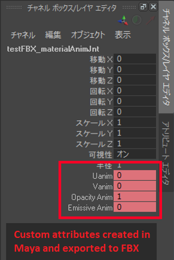
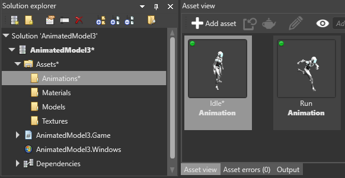
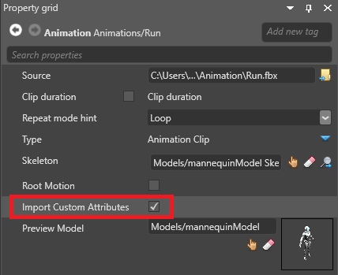

# Custom attributes

<span class="label label-doc-level">Intermediate</span>

You can import custom attributes created in modeling tools such as Maya. 

Currently, you can only import custom **animated** attributes. Attributes that aren't animated can't be imported.



## 1. Import custom attributes

1. Import the animation. For instructions, see [Import animations](import-animations.md).

2. In the **asst view**, select the animation asset.

    

2. In the **property grid**, select **Import custom attributes**.

    

    When the assets are built, Xenko imports the custom attributes from the FBX file.

## 2. Control custom attributes with a script

Add a script to read the custom attributes and copy them to a property. This can be a separate script, or part of another [animation script](animation-scripts.md).

To look up an attribute, use `NodeName_AttributeName`. For example, if you have the node `myNode` with the custom attribute `myAttribute`, use `myNode_myAttribute`.

### Example script

```cs
using SiliconStudio.Xenko.Animations;
using SiliconStudio.Xenko.Engine;
using SiliconStudio.Xenko.Rendering;
using SiliconStudio.Xenko.Audio;
using SiliconStudio.Xenko.Rendering.Materials;
 
namespace Sample
{ 
    public class HologramScript : SyncScript
    { 
        public Material MyMaterial;
 
        private AnimationComponent animationComponent;
        private AnimationProcessor animationProcessor;
 
        public override void Start() 
        { 
            base.Start(); 
 
            animationComponent = Entity.GetOrCreate<AnimationComponent>(); 
            animationProcessor = 
SceneSystem.SceneInstance.Processors.OfType<AnimationProcessor>().FirstOrDefault();     
        } 
 
        public override void Update() 
        { 
            if (animationProcessor == null || MyMaterial == null) 
                return; 
 
   // Animation result may be Null if animation hasn't been played yet. 
            var animResult = 
animationProcessor.GetAnimationClipResult(animationComponent); 
            if (animResult == null) 
                return; 
 
   // Read the value of the animated custom attribute: 
   float emmisiveIntensity; 
            unsafe 
            { 
                fixed (byte* structures = animResult.Data) 
                { 
                    foreach (var channel in animResult.Channels) 
                    { 
                        if (!channel.IsUserCustomProperty) 
                            continue; 
                         
                        var structureData = (float*)(structures + channel.Offset); 
                        var factor = *structureData++; 
                        if (factor == 0.0f) 
                            continue; 
 
                        var value = *structureData; 
                        if (channel.PropertyName == 
"myNode_myProperty") 
                            emmisiveIntensity = value; 
                    } 
                } 
            } 
    
   // Bind the material parameter: 
  
 MyMaterial.Passes[0].Parameters.Set(MaterialKeys.EmissiveIntensity, 
emmisiveIntensity) 
        } 
    } 
}