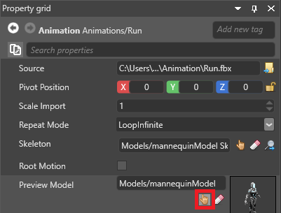

# Preview animations

Intermediate
Designer

After you [import an animation](import-animations.md), you can preview it in the **asset preview**. 

<video autoplay loop class="responsive-video" poster="media\animations-import-animations-animation-preview.jpg">
       <source src="media\animations-import-animations-animation-preview.mp4" type="video/mp4">
</video>

By default, the asset preview is in the bottom-right under the **Asset preview** tab.

>[!Tip]
>To rotate the animation, click and drag the mouse.  

The animation preview uses the model selected in the **preview model** in the **animation asset properties**.

## Set the preview model

1. In the **asset view** (at the bottom by default), select the animation asset.

    

2. In the **property grid** (on the right by default), under **Preview model**, click  (**Pick an asset up**).

    

    The **asset picker** opens.

3. Select the model you want to use to preview the animation.

    >[!Note]
    >Make sure the model and the animation share identical skeletons.

## See also

* [Animation index](index.md)
* [Import animations](import-animations.md)
* [Animation properties](animation-properties.md)
* [Set up animations](set-up-animations.md)
* [Animation scripts](animation-scripts.md)
* [Additive animation](additive-animation.md)
* [Procedural animation](procedural-animation.md)
* [Custom blend trees](custom-blend-trees.md)