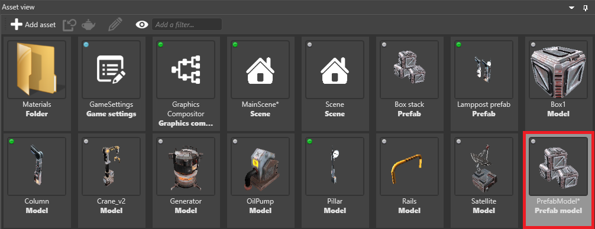

# Prefab models

**Prefab models** render prefabs as single models. This is useful for optimization, as Xenko only renders a single model instead of the separate prefab elements.

## Create a prefab model

1. In the **asset view**, select **Add asset > Model > Prefab model**.

    

2. In the property grid (on the right by default), next to **Prefab**, click  (**Select asset**).

3. In the **Select asset** window, select the prefab you want to create a model from and click **OK**.

    

    Game Studio adds the prefab model to the asset view.

    

When you make changes to the prefab itself, Game Studio updates the prefab model automatically.

## See also

* [Create a prefab](create-a-prefab.md)
* [Use prefabs](use-prefabs.md)
* [Edit prefabs](edit-prefabs.md)
* [Nested prefabs](nested-prefabs.md)
* [Override prefab properties](override-prefab-properties.md)
* [Archetypes](../archetypes.md)