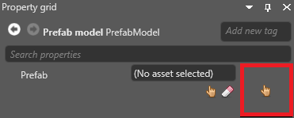

# Prefab models

Beginner
Designer

**Prefab models** convert prefabs to single models. This is useful for optimization, as Xenko only renders the model instead of the separate entities in the prefab. When you make changes to the prefab, Game Studio updates the prefab model automatically.

Currently, prefab models don't inherit elements such as lights, colliders, or other components - they're only models, and have to be used just like other models. For example, if you have a prefab comprising two models and a light component, the prefab model creates a single model from the two models and ignores the light component. If you need to add components to a prefab model, add them to the prefab model itself.

## Create a prefab model

1. In the **asset view**, select **Add asset > Model > Prefab model**.

    

2. In the property grid (on the right by default), next to **Prefab**, click  (**Select asset**).

    

    The **Asset picker** opens.

    

3. Select the prefab you want to create a model from and click **OK**.

    Game Studio adds the prefab model to the asset view.

    

## See also

* [Create a prefab](create-a-prefab.md)
* [Use prefabs](use-prefabs.md)
* [Edit prefabs](edit-prefabs.md)
* [Nested prefabs](nested-prefabs.md)
* [Override prefab properties](override-prefab-properties.md)
* [Archetypes](../archetypes.md)