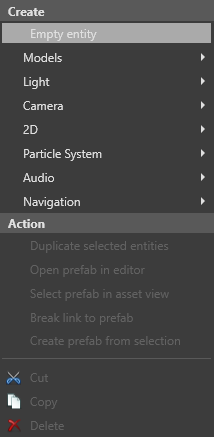

# Animate a camera with a model

Beginner
Artist

You can use model files such as `.fbx` or `.obj` to animate cameras at runtime.

>[!Note]
>To animate a camera using a model file, you first need to bake the animation using your modeling tool (eg Maya, 3ds Max or Blender).

>[TODO] Xenko doesn't support cameras animated using target cameras.

## 1. Import the model file

Import the model, animation and skeleton from the model file. To do this:

1. Drag the model file from Explorer to the **asset view** (in the bottom pane by default).

    * Alternatively, in the **asset view**:

        1a. Click  and select **Import directly from files**.
    
        

        2b. Browse to the model file and click **Open**.

2. Select **3D model**.

    

    The **Import from model** dialog opens.

    

2. Make sure **Import skeleton** is selected and click **OK**.

    Game Studio imports the **model** and **skeleton** from the model file and adds them to the asset view.

    

3. Repeat step 1 to import the model file again. This time, select **Animation**.

    

    Game Studio imports the **animation clip** from the model file and adds it to the asset view.

    

## 2. Set up the entities

In the **scene editor**, create an entity to hold the camera you want to animate.

1. Right-click the scene, select **Empty entity**, and type a name.

    

    

2. Select the entity you created in the previous step. In the **property grid** on the right, click **Add component** and select **Animations**.

    

    Game Studio adds an animation component to the entity.

    

3. Next to **Animations**, click  (**Add...**) and type a name.

    

    Game Studio adds an animation to the list.

    

4. Next to the animation you added, click  (**Select an asset**).

    The **Select an asset** window opens.

    

5. Select the camera animation asset and click **OK**.

## 3. Set up the animation

Create a script to control the animation. To do this:

1. To do this, in the **asset view**, click **Add asset** and select **Script > Animation start**.

    

    The **New script** window opens.

    

2. Type a name for the script and click **Create script**.

    If Game Studio asks if you want to save your script, click **Save script**.

    >[!Note]
    >For more information about animation scripts, see [Animation scripts](../../animation/animation-scripts.md).

3. Reload the assemblies.

    

4. Select the entity you created earlier. In the **property grid**, click **Add component** and select the animation script.

    

    Game Studio adds the script to the entity as a component.

5. Under the script component, next to **Animations**, click  (**Add...**).

    

6. Next to **Clip**, click  (**Select an asset**).

    The **Select an asset** window opens.

    

7. Select the camera animation and click **OK**.

8. Click **Add component** and select **Model**.

    

    Game Studio adds a model component to the entity.

    

9. Next to **Model**, click  (**Select an asset**)
    
    The **Select an asset** window opens.

    

10. Select the camera model and click **OK**.

## 4. Set up the model node link

The node model link component connects an entity to a node in a model contained in another entity. You can use it to connect the camera to the camera holder, which contains the model and animation.

1. In the **entity tree**, drag the **camera entity** you want to animate to the entity you created. This makes the camera a child of the entity.

    

2. Select the camera entity.

3. In the **property grid**, click **Add component** and select **Model node link**.

    Game Studio adds a model link component to the entity.

4. In **Node name**, select the node you want to link to from the file.

    

5. Leave **Target** blank. This means the entity attaches itself to the parent entity.

At runtime, the camera animates according to the model file.

## See also

* [Animation](../../animation/index.md)
* [Animation scripts](../../animation/animation-scripts.md)