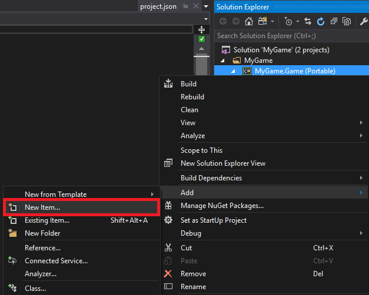
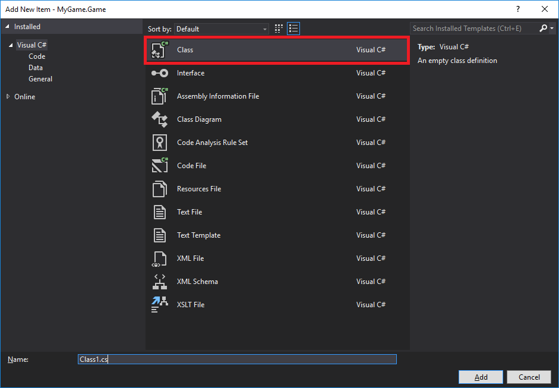
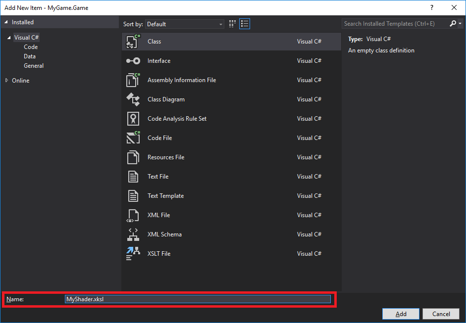
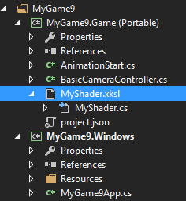
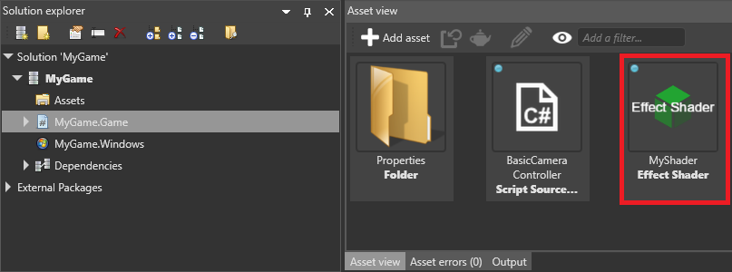
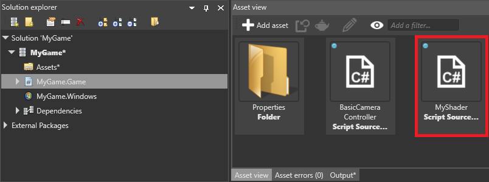
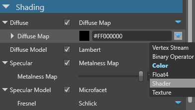
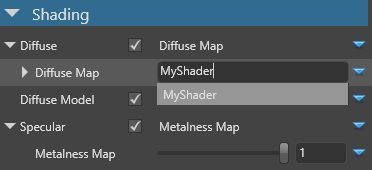

# Custom shaders

<span class="label label-doc-level">Intermediate</span>
<span class="label label-doc-audience">Programmer</span>

You can write your own shaders in Visual Studio and use them in [material attributes](../materials/material-attributes.md). This lets you extend Xenko's shaders to produce more complex results. For example, you can write a shader to add textures to materials based on the objects' world positions, or generate noise and use it to randomize material properties.

As shaders are text files, you can add comments, edit them, enable and disable lines of code and treat them like any other code file. This makes them easy to maintain and iterate.

## Create a shader

1. Make sure you have the [Xenko Visual Studio extension](../../get-started/visual-studio-extension.md) installed. This is necessary to convert the shader files from XSL ([Xenko shading language](index.md)) to `.cs` files.

2. In Game Studio, in the toolbar, click  (**Open in IDE**) to open your project in Visual Studio.

3. In the Visual Studio **Solution Explorer**, right-click the project (eg *MyGame.Game*) and select **New item**.

    

4. Select **Class**.

    

5. In the **Name** field, specify a name and change the extension to **.xksl** (eg *MyShader.xksl*).

    

6. Click **Add**.

    The Xenko Visual Studio extension automatically generates a `.cs` file from the `.xksl` file. The Solution Explorer lists it as a child of the `.xskl` file.

    

7. Open the the `.xksl` file, remove the existing lines, and write your shader.

    Shaders are written in Xenko Shading Language (XSL), which is based on HLSL. For more information, see [Shading language](index.md).

    For example, this shader creates a green color (`RGBA 0;1;0;1`):

    ```cs
    namespace MyGame
    {
        shader MyShader : ComputeColor
        {
            override float4 Compute()
            {
                return float4(0, 1, 0, 1);
            }
        };
    }
    ```

    >[!Note]
    >Make sure the shader name in the file (eg `MyShader` above) is the same as the filename.

6. Save all the files in the solution (**File > Save All**).

7. In Game Studio, reload the assemblies.

    

    The **asset view** lists the shader in the same directory as your scripts (eg **MyGame.Game**).

    

    >[!Note]
    >In some situations, Game Studio might only detect the shader as a script, as in the screenshot below:
    > 
    
    >If this happens, restart Game Studio (**File > Reload project**).

## Use a custom shader

You can use custom shaders in any [material attribute](../materials/material-attributes.md).

1. In the **asset view**, select the material you want to use the shader in.

2. In the **property grid**, next to the property you want to control with the shader, click  (**Create an instance with the selected type**) and select **Shader**.

    

3. In the field, type the name of your shader (eg *MyShader*).

    

    The property uses the shader you specify.

> [!Tip]
> When you make a change to the `.xksl` file in Visual Studio and save it, Game Studio automatically updates the project with your changes.

> [!Note]
> If you delete a shader from the project assets, to prevent errors, make sure you also remove it from the properties of materials that use it.

## See also

* [Shading language](index.md)
* [Custom post effects](../post-effects/custom-post-effects.md)
* [Material attributes](../materials/material-attributes.md)
* [Xenko Visual Studio extension](../../get-started/visual-studio-extension.md)