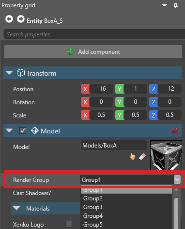
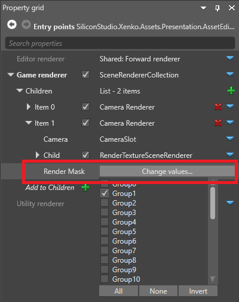

# Render groups and masks

Intermediate
Designer

With **render groups** and **render masks**, you can choose which models are rendered by different [cameras](../cameras.md). For example, you can have a model be visible to Camera A but invisible to Camera B.

## Set a render group

1. In the scene, select the entity with the model component you want to add to a render group.

2. In the **property grid**, next to **Render group**, select the group you want the model to belong to.

    

## Set a render mask

The **render mask** filters which groups are rendered.

1. In the **asset view** (in the bottom pane by default), double-click the **Graphics Compositor** asset.

    

    The graphics compositor editor opens.

    

2. Select the **Entry points** node.

    

3. In the **property grid** on the right, expand the renderer you want to render the model.

3. Next to **Render mask**, click **Change values** and select the render groups you want the camera to render.

    

## See also

* [Cameras](../cameras.md)
* [Camera slots](../camera-slots.md)
* [Graphics compositor](index.md)
* [Scene renderers](scene-renderers.md)
* [Render textures](render-textures.md)