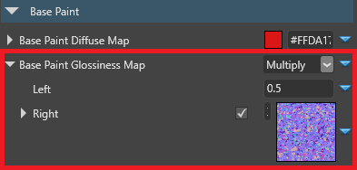

# Clear-coat shading

Intermediate
Artist
Programmer

**Clear-coat shading** uses physically-based rendering to simulate vehicle paint.

Real vehicles typically have three layers of paint applied to the body, as in the diagram below:

To keep the shading simple, Xenko only simulates the **clear coat** and **base coat** layers and blends them depending on how far the camera is from the material.

## Add a clear-coat material

Xenko includes a clear-coat material template. To add it, in the **asset view**, click **Add asset** and select **Material > PBR material: clear coat**.

Alternatively, to set clear-coat properties yourself:

1. Select the material you want to use clear-coat shading.

2. In the property grid, under the **Misc** properties, next to **Clear coat**, click  (**Change...**) and choose **Clear coat**.

    

    >[!Note]
    >For clear-coat shading to work correctly, make sure you enable **Diffuse**, **Specular** and **Specular model** under the material **Shading** properties.
    
    >

## Properties

| Property | Description 
|------------------------------|----------
| Base paint diffuse map  |  The [diffuse map](shading-attributes.md) used by the base paint layer (the lowest  layer). This determines the color of the layer.
| Base paint glossiness map |  The [glossiness map](geometry-attributes.md) used by the base paint layer. For a coherent result, this should use the **metal flakes normal map** as a mask.         
| Metal flakes diffuse map  |  The [diffuse map](shading-attributes.md) used by the metal flakes layer (the layer above the base paint). For a coherent result, the metal flakes layer should use a value close to the base paint value.
| Metal flakes glossiness map | The [glossiness map](geometry-attributes.md) used by the metal flakes layer. For a coherent result, this should use the **Metal flakes normal map** as a mask. 
| Metal flakes metalness map | The [metalness map](shading-attributes.md) used by the metal flakes layer. For best results, use high values.
| Metal flake normal map  | The [normal map](normal-maps.md) used by the metal flake layer. This shapes the flake geometry. A metal flake normal map is included in the Xenko assets package (**XenkoClearCoatMetalFlakesNM**). To reduce pattern visibility, enable **Use random texture coordinates** and use a high **UV scale**.
| Coat glossiness map  | The [glossiness map](geometry-attributes.md) used by the clear coat layer. You can change this value to simulate different kinds of paint (eg matte).
| Clear coat metalness map  | The [metalness map](shading-attributes.md) used by the clear coat layer  
| Orange peel normal map  | The [normal map](normal-maps.md) used by the clear coat layer. In real life, orange peel is an imperfection in paint whereby the paint texture appears bumpy, like the skin of an orange. This causes light to reflect in different angles around the imperfections. A metal flake normal map is included in the Xenko assets package (**XenkoClearCoatOrangePeelNM**).
| Layer transition distance  | The distance (in meters) at which the base paint layer transitions to the metal flake layer

Properties that use binary operators should use **normalized values** (ie between `0.0` and `1.0`). For example, in the screenshot below, the **left** operator uses a value of `0.5`.

Values over `1.0` might produce artifacts, as in the image below (note the grid pattern):

## See also

* [Material maps](material-maps.md)
* [Material attributes](material-attributes.md)
    * [Geometry attributes](geometry-attributes.md)
    * [Shading attributes](shading-attributes.md)
    * [Misc attributes](misc-attributes.md)
* [Material layers](material-layers.md)
* [Materials for developers](materials-for-developers.md)