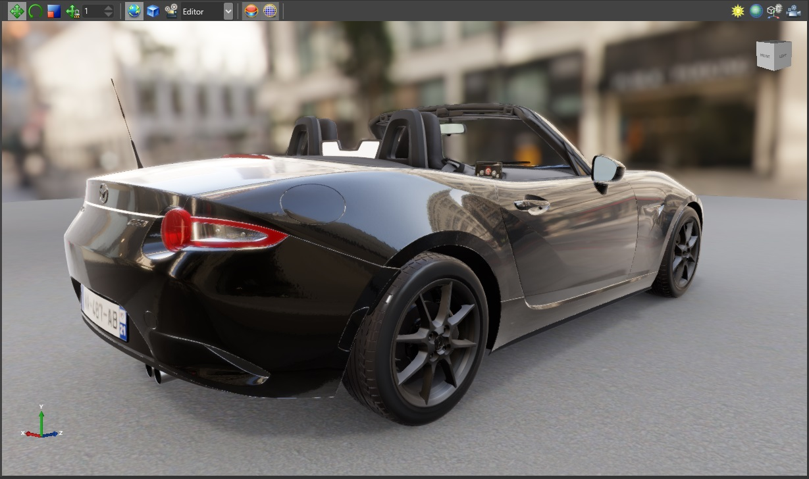

# Clear-coat shading

**Clear coat shading** uses physically-based rendering to simulate car paint.

Real vehicles typically have three layers of paint, as in the diagram below:

*Figure 1: Paint layers (source: https://d3vl3jxeh4ou3u.cloudfront.net/2%20-%20How%20to%20Remove%20Scratches%20from%20a%20Car%20-%20pa int%20layer%20diagram.jpg)*

To keep the shading as simple as possible, Xenko only simulates the **clear coat** and **base coat** layers.

## Add a clear-coat material

Xenko includes a clear-coat material template. To add it, n the **asset view**, click **Add asset** and select **Material > PBR material: clear coat**.

Alternatively, to configure clear-coat material properties yourself:

1. Select the material you want to use clear-coat shading.

2. In the property grid, under the **Misc** properties, next to **Clear coat**, click  (**Change...**) and choose **Clear coat**.

    

## Properties

| Property | Description 
|------------------------------|----------
| Base paint diffuse map  |  The diffuse map used by the base paint layer (the lowest  layer). This determines the color of the layer.
| Base paint glossiness map |  The glossiness map used by the base paint layer. For a coherent result, this should use the **metal flakes normal map** as a mask.         
| Metal flakes diffuse map         |  The diffuse map used by the metal flakes layer (the layer above the base paint). For a coherent result, the metal flakes layer should use a value close to the base paint value.
Metal flakes glossiness map | The glossiness map used by the metal flakes layer. For a coherent result, this should use the **Metal flakes normal map** as a mask. 
Metal flakes metalness map | The metalness map used by the metal flakes layer. Since the metal flakes are metallic, for a coherent result, this input should use high values.
Metal flakes normal map  | The normal map used by the metal flakes layer. This shapes the flake geometry. A metal flakes normal map is included in the Xenko assets package (**XenkoClearCoatOrangePeelNM**). We recommend you use the **Use random texture coordinates** option to reduce the pattern (see the section below).
 Coat glossiness map  | The glossiness map used by the clear coat layer. In real life, regular metallic paint surfaces are glossy. You can change this value to simulate different kinds of paint (eg matte paint).
Clear coat metalness map  | The metalness map used by the clear coat layer  
Orange peel normal map  | the normal map used by the clear coat layer. In real life, orange peel is an imperfection in paint whereby the paint texture appears bumpy, like the skin of an orange. This causes light to reflect in different angles around the imperfections. A metal flakes normal map is included in the Xenko assets package (**XenkoClearCoatOrangePeelNM**).
Scale & offset / Reconstruct Z  | (same as a regular normal map feature). Each option set is specific to the normal map above it.
Invert glossiness  | (same as the Micro Surface feature). Each option set is specific to the glossiness map above it. 
Layer transition distance  | the distance (in meters) at which the base paint layer transitions to the metal flakes layer