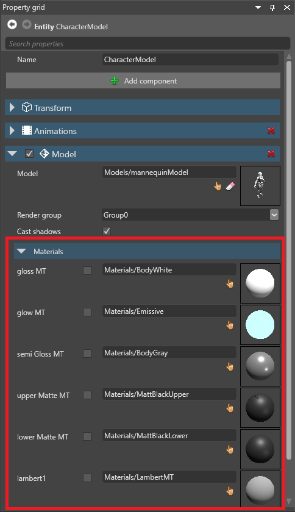
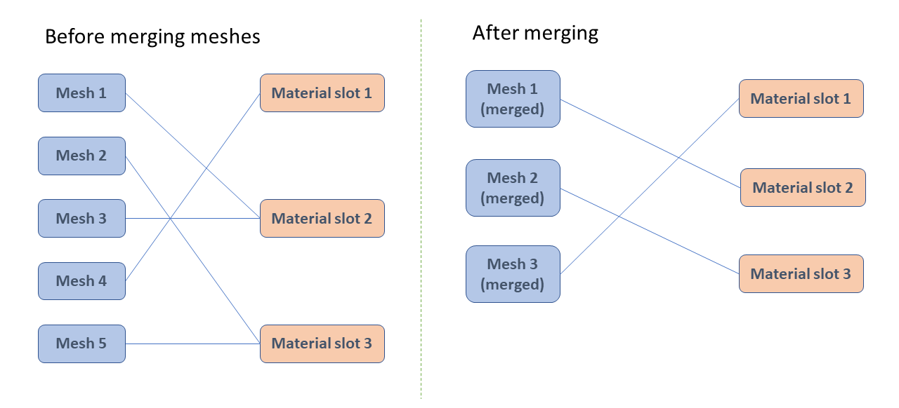

# Material slots

<span class="label label-doc-level">Intermediate</span>
<span class="label label-doc-audience">Artist</span>
<span class="label label-doc-audience">Programmer</span>

Models can use multiple materials. You can set the materials in the model's **material slots**.


For example, the second material slot in this model specifies the material for the visor and the shoulder and chest plate stripes. By changing the material in this slot, we change the material used in these parts of the model.


The material slots themselves — their number and position — are defined in the model source file (eg  `.fbx`, `.obj`, etc). You can't edit material slots in Game Studio; you can only change which materials are used in each slot.

## Set materials on a model

You can change the materials a model uses in two places:

* Under the **Materials** properties of the model itself:

    

    >[!Note]
    >This affects every instance of this model.
 
* In the **model component** of an entity or [prefab](../../game-studio/prefabs/index.md):

    

     This only affects **this** instance or prefab.

## Submeshes and material slots

Models imported from modeling software can contain smaller meshes (**submeshes**). Submeshes can share materials via material slots.


The association between a submesh and a material slot is defined in the model source file. You can't change these associations in Game Studio, but you can change them in code at runtime.

To change the association between a submesh and a material, use:

```cs
MyModelComponent.Model.Meshes[submeshIndex].MaterialIndex = materialIndex;
```

To change or add a material to the list of materials:

```cs
MyModelComponent.Materials[ExistingOrNewMaterialIndex] = myMaterial;
```

### Merging submeshes

When Xenko draws a model with submeshes, it performs one GPU draw call for each mesh. By default, to improve performance, at build time, Xenko merges submeshes that share materials.



In the example above, there are five submeshes and five draw calls. After merging, there are three submeshes and three draw calls.

>[!Note]
>When Xenko merges submeshes, it merges the vertex and index buffers. This means you can't draw the submeshes separately at runtime, and you can't change the original submesh position (transformation matrix). The submeshes become a single mesh with a single material and a single transformation matrix (relative to the model).

>[!Note]
>When Xenko merges submeshes, it changes the draw order of elements. In the case of transparent materials, this can produce different results.

>[!Note]
>When you create a [physics collider from a model](../../physics/collider-shapes.md), Xenko builds separate convex hulls for each submesh in the model. If the submeshes are merged, only one submesh remains per material, so convex hulls are also built from merged submeshes.

### Disable merging

To disable merging for specific submeshes, enable their corresponding **nodes**.

1. Select the model that contains the submeshes.

2. In the **Property grid**, under **Skeleton**, make sure the model has a skeleton associated with it.

    

    For more information about skeletons, see [Animation](../../animation/index.md).

3. In the **Asset view**, select the skeleton associated with the model.

    

4. In the **Property grid**, under **Nodes**, select the nodes that correspond to the submeshes you don't want to merge.

    

    >[!Tip]
    >To see which nodes correspond to which submesh, open the model source file in a modeling application such as Maya.

    >[!Note]
    >Make sure you don't disable nodes that are animated at runtime.

## See also

* [Material maps](material-maps.md)
* [Material attributes](material-attributes.md)