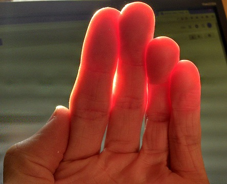

# Subsurface scattering

Intermediate
Artist

**Subsurface scattering** reflects light at irregular angles inside models. You can use it to realistically render translucent materials such as skin, wax, leaves, marble, and porcelain.

The photo below demonstrates a real-life example of the effect:

*(Image courtesy of Davepoo2014, shared under [Creative Commons Attribution-Share Alike 4.0 International license](https://creativecommons.org/licenses/by-sa/4.0/deed.en))*

The images below demonstrate the use of subsurface scattering in Xenko to render wax:

| Subsurface scattering off           | Subsurface scattering on
|--------------------|--------------------
|    | 

Note how the shadows are much softer in the second image, as more light is passing through the candles.

## Translucency

**Translucency** controls the degree to which light pentrates the material. `0.0` is no translucency; `1.0` is max.

| Transluency: `0.2`           | Transluency: `0.98`
|--------------------|--------------------
|    | 

| Property           | Function
|--------------------|--------------------
| Scattering width   | How far the light scatters in [world units](../../game-studio/world-units.md)
| Translucency       | 
| Translucency map   | Specify a [grayscale map](material-maps.md) to control how translucent different regions of the material are. Brighter values produce more scattering. For example, ears should scatter more light than the top of the head, because they're thinner and therefore light passes through them more easily. The texture is multiplied by the **Translucency** parameter.
| Scattering profile | The scattering profile to use during the forward render pass.  **Custom (skin-based):** ?  **Skin:** A preconfigured shader for rendering skin
| Scattering kernel  | The scattering kernel to use in the subsurface scattering post process.  **Falloff:** Scattered light is masked to this color  **Strength:** Fades to this color

## Global subsurface scattering options

These options apply globally to all materials that use subsurface scattering. There are additional controls related to the effect in the **[graphics compositor](../graphics/graphics-compositor/index.md)**.

1. In the **asset view** (in the bottom pane by default), double-click the **Graphics Compositor** asset.

    

    The graphics compositor editor opens.

2. In the graphics compositor editor, select the **Subsurface scattering blur** node.

3. In the **property grid** (on the right by default), edit the properties.

    

### Properties

| Property           | Function                                                        
|--------------------|-----------
| Follow surface     | Prevent light scattering across large depth differences. Affects GPU performance.
| Passes             | The number of times the blur is executed. More passes produce smoother results (less noise and banding).
| Jitter kernel size | Use noise to reduce banding artifacts caused by undersampling. Creates a smoother effect, but is technically less accurate (sometimes noticeable on closeups)
| Render mode        | Change the render mode for debugging purposes

## See also

* [Material maps](material-maps.md)
* [Material attributes](material-attributes.md)
    * [Geometry attributes](geometry-attributes.md)
    * [Shading attributes](shading-attributes.md)
    * [Misc attributes](misc-attributes.md)
* [Material layers](material-layers.md)
* [Materials for developers](materials-for-developers.md)