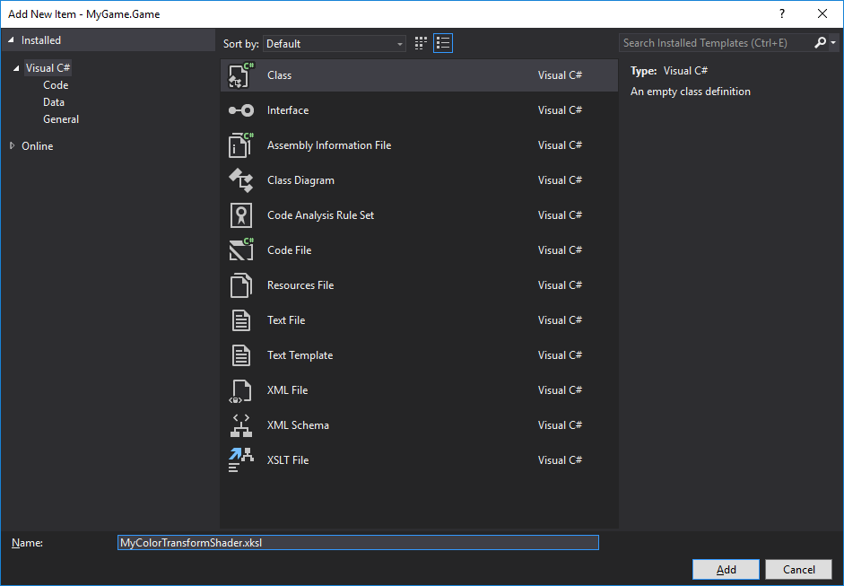
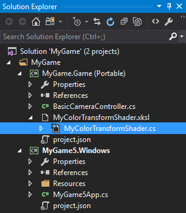
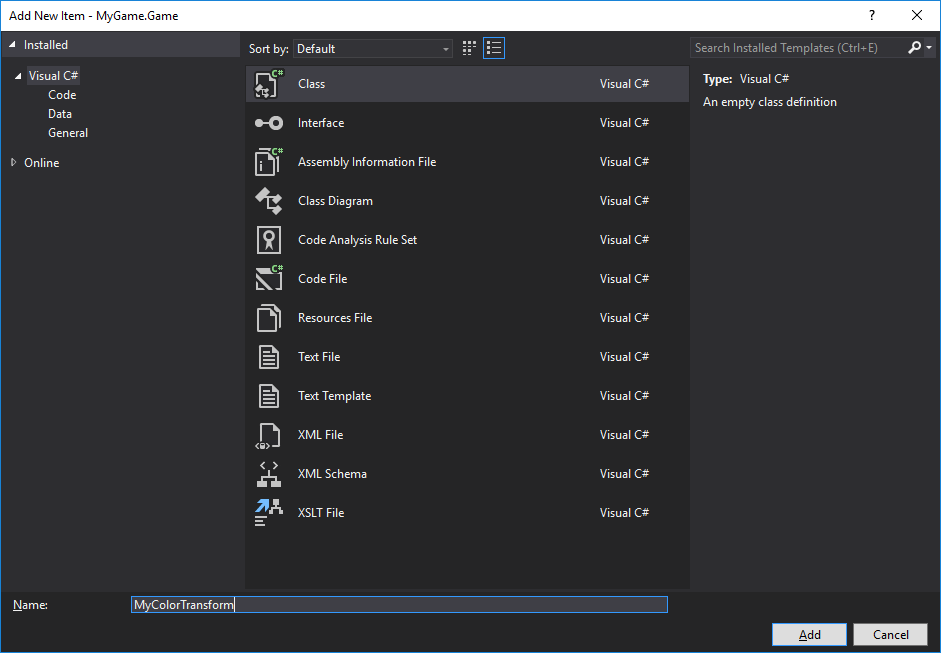
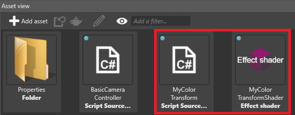
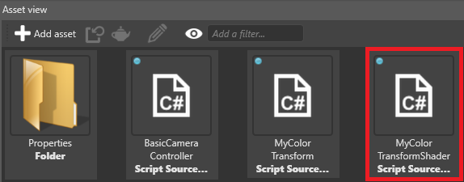
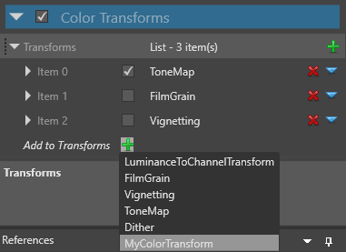
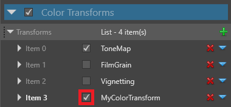
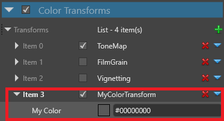

# Custom color transforms

<span class="label label-doc-level">Advanced</span>
<span class="label label-doc-audience">Programmer</span>

You can write your own **custom color transform** effects. For example, you can create:

* water droplets on the camera
* screen transitions (such as fade-ins and fade-outs)
* effects simulating pain or intoxication (eg by applying tints or other effects)
* object outlines

To create a custom color transform, you need to write two files: an effect shader (containing the effect itself), and a C# class (to make the effect accessible in Game Studio).

## 1. Create a shader

1. Make sure you have the [Xenko Visual Studio extension](../../../get-started/visual-studio-extension.md) installed. This is necessary to convert the shader files from XSL ([Xenko shading language](index.md)) to `.cs` files.

2. In Game Studio, in the toolbar, click  (**Open in IDE**) to open your project in Visual Studio.

3. In the Visual Studio **Solution Explorer**, right-click the project (eg *MyGame.Game*) and select **New item**.

    

4. Select **Class**.

    

5. In the **Name** field, specify a name with the extension **.xksl** (eg *MyColorTransformShader.xksl*), and click **Add**.

    

    The Xenko Visual Studio extension automatically generates a `.cs` file from the `.xksl` file. The Solution Explorer lists it as a child of the `.xskl` file.

    

7. Open the the `.xksl` file, remove the existing lines, and write your shader.

    Shaders are written in Xenko Shading Language (XSL), which is based on HLSL. For more information, see [Shading language](index.md).

    For example, the shader below multiplies the image color by the `MyColor` parameter:

    ```cs
    shader MyColorTransformShader : ColorTransformShader
    {
        [Color]
        float4 MyColor;

        override float4 Compute(float4 color)
        {
            return color * MyColor;
        }
    };
    ```
    >[!Note]
    >Make sure the shader name in the file (eg `MyColorTransformShader` in the code above) is the same as the filename (eg *MyColorTransformShader.xksl*).

## 2. Create a C# class

1. In the Visual Studio **Solution Explorer**, right-click the project (eg *MyGame.Game*) and select **Add > New item**.

    

2. Select **Class**, specify a **name** (eg *MyColorTransform.cs*), and click **Add**.

    

    Open the the file and write the class.

    For example, the code below creates the class `MyColorTransform`, which uses the shader and supplies a value for the color `MyColor` (defined in the shader).

    ```cs
    using SiliconStudio.Core;
    using SiliconStudio.Core.Mathematics;
    using SiliconStudio.Xenko.Rendering;
    using SiliconStudio.Xenko.Rendering.Images;

    namespace MyGame
    {
        [DataContract("MyColorTransform")]
        public class MyColorTransform : ColorTransform
        {
            /// <inheritdoc />
            public MyColorTransform() 
                : base("MyColorTransformShader")
            {
            }

            public Color4 MyColor { get; set; }

            public override void UpdateParameters(ColorTransformContext context)
            {
                Parameters.Set(MyColorTransformShaderKeys.MyColor, MyColor);

                // Copy parameters to parent
                base.UpdateParameters(context);
            }
        }
    }
    ```
    >[!Note]
    >Make sure the class name in the file (eg `MyColorTransform` in the class above) is the same as the filename (eg *MyColorTransform.cs*).

3. Save all the files in the solution (**File > Save All**).

4. In Game Studio, reload the assemblies.

    

    The **asset view** lists the class and effect shader in the same directory as your scripts (eg **MyGame.Game**).

    

    >[!Note]
    >In some situations, Game Studio incorrectly detects the shader as a script, as in the screenshot below:

    >
    
    >If this happens, restart Game Studio (**File > Reload project**).

## 3. Use a custom color transform

1. In the **asset view** (in the bottom pane by default), double-click the **Graphics Compositor** asset.

    

    The **graphics compositor editor** opens.

    

2. Select the **Post-processing effects** node.

3. In the **property grid**, under **Color transforms**, click  (**Create an instance with the selected type**) and select your color transform (eg **MyColorTransform**).

    

* To enable and disable the effect, use the check box next to the item.

    

* To edit the public properties you specified in the class, expand the item.

    

    When you adjust the properties, Game Studio updates the effect automatically.

>[!Warning]
>Unfortunately, this part of Game Studio has a memory leak problem. Every time you change a value in the graphics compositor, it uses 60MB of memory. To prevent Game Studio using too much memory, we recommend you restart it after you change a property a few times. This is a known issue.

## See also

* [Shading language](../../effects-and-shaders/index.md)
* [Custom shaders](../../effects-and-shaders/custom-shaders.md)
* [Graphics compositor](../../graphics-compositor/index.md)
* [Post effects](../index.md)
* [Color transforms](index.md)
* [Xenko Visual Studio extension](../../../get-started/visual-studio-extension.md)