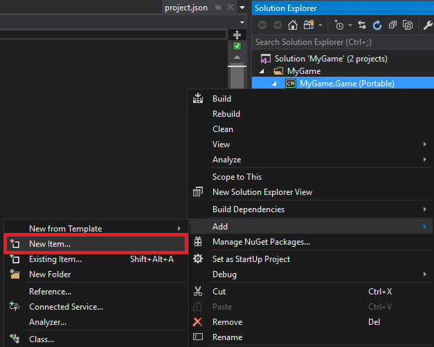

# Custom post effects

<span class="label label-doc-level">Intermediate</span>
<span class="label label-doc-audience">Programmer</span>

You can write your own unique post effects. Custom post effects use the final frame rendered by Xenko (including lighting and other post effects) as the input. The post effects are then applied over this frame.

For example, you can create:

- effects simulating pain or intoxication (eg by applying tints or other effects)
- water droplets on the camera
- screen transitions (such as fade-ins and fade-outs)
- object outlines

To use a custom post effect, you need to write two files: a shader (which contains the effect), and a script (to make the effect accessible in Game Studio).

## 1. Create a post effect shader

Creating a post effect shader is the same process as creating a [custom shader](../effects-and-shaders/custom-shaders.md).

1. Make sure you have the [Xenko Visual Studio extension](../../get-started/visual-studio-extension.md) installed. This is necessary to convert the shader files from XSL ([Xenko shading language](index.md)) to `.cs` files.

2. In Game Studio, in the toolbar, click  (**Open in IDE**) to open your project in Visual Studio.

3. In the Visual Studio **Solution Explorer**, right-click the project (eg *MyGame.Game*) and select **New item**.

    

4. Select **Class**.

    

5. In the **Name** field, specify a name and change the extension to **.xksl** (eg *MyPostFx.xksl*).

    

6. Click **Add**.

    The Xenko Visual Studio extension automatically generates a `.cs` file from the `.xksl` file. The Solution Explorer lists it as a child of the `.xskl` file.

    

7. Open the the `.xksl` file, remove the existing lines, and write your post effect shader.

    Shaders are written in Xenko Shading Language (XSL), which is based on HLSL. For more information, see [Shading language](index.md).

    For example, this post effect shader is a [color transform](index.md) that multiplies the image color by the `MyColor` parameter:

    ```cs
    shader MyPostFx : ColorTransformShader
    {
        [Color]
        float4 MyColor;

        override float4 Compute(float4 color)
        {
            return color * MyColor;
        }
    };
    ```
    >[!Note]
    >Make sure the shader name in the file (eg `MyPostFx` in the code above) is the same as the filename (eg *MyPostFx.xksl*).

## 2. Create a custom post effect script

1. In the Visual Studio **Solution Explorer**, right-click the project (eg *MyGame.Game*) and select **New item**.

    

2. Select **Class**, type a name (eg *MyPostFxScript.cs*), and click **Add**.

    

    Open the the file and write the post effect script.

    For example, this script specifies the shader the post effect uses (`MyPostFx`) and the `MyColor` parameter to the `MyPostFx` shader (in `UpdateParameters`):

    ```cs
    using SiliconStudio.Core;
    using SiliconStudio.Core.Mathematics;
    using SiliconStudio.Xenko.Rendering;
    using SiliconStudio.Xenko.Rendering.Images;

    namespace MyGame9
    {
        [DataContract("MyPostFxScript")]
        public class MyPostFxScript : ColorTransform
        {
            /// <inheritdoc />
            public MyPostFxScript() 
                : base("MyPostFx")
            {
            }

            public Color4 MyColor { get; set; }

            public override void UpdateParameters(ColorTransformContext context)
            {
                Parameters.Set(MyPostFxKeys.MyColor, MyColor);

                // Copy parameters to parent
                base.UpdateParameters(context);
            }
        }
    }
    ```
    >[!Note]
    >Make sure the post effect script name in the file (eg `MyPostFxScript` in the script above) is the same as the filename (eg *MyPostFxScript.cs*).

3. Save all the files in the solution (**File > Save All**).

4. In Game Studio, reload the assemblies.

    

    The **asset view** lists the post effect script and shader in the same directory as your scripts (eg **MyGame.Game**).

    

    >[!Note]
    >In some situations, Game Studio might only detect the shader as a script, as in the screenshot below:

    > 
    
    >If this happens, restart Game Studio (**File > Reload project**).

## 3. Use a custom post effect

To use a custom post effect, enable it in the graphics compositor properties.

1. In the **asset view** (in the bottom pane by default), double-click the **Graphics Compositor** asset.

    

    The **graphics compositor editor** opens.

    

2. Select the **Post-processing effects** node.

3. In the **property grid** graphics compositor, under **Color transforms**, click  (**Create an instance with the selected type**) and select the post effect script (eg **MyPostFxScript**).

    

* To enable and disable the effect, use the check box next to the post effect script item.

    

* To edit the properties you specified in the script, expand the post effect script item.

    

    When you adjust the properties, Game Studio updates the effect automatically.

>![Warning]
>Every time you change a value in the graphics compositor, it uses 60MB of memory. To prevent Game Studio using too much memory, we recommend you restart it after you change a property a few times. This is a known issue.

## See also

* [Shading language](../effects-and-shaders/index.md)
* [Custom shaders](../effects-and-shaders/custom-shaders.md)
* [Graphics compositor](../graphics-compositor/index.md)
* [Post effects index](index.md)
* [Xenko Visual Studio extension](../../get-started/visual-studio-extension.md)
