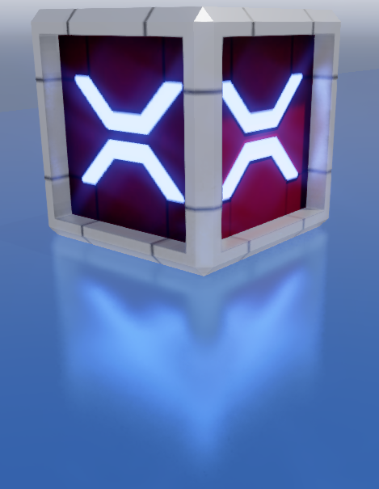
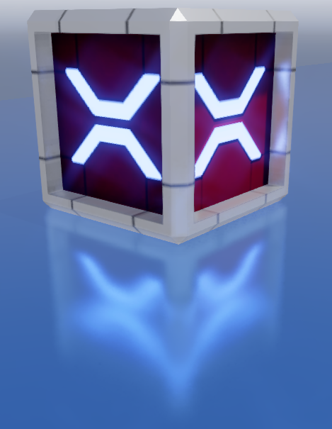
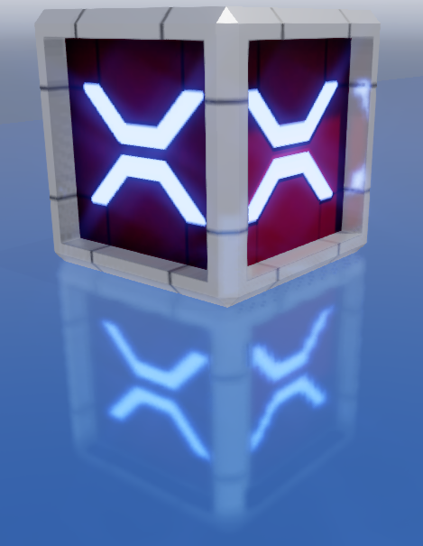
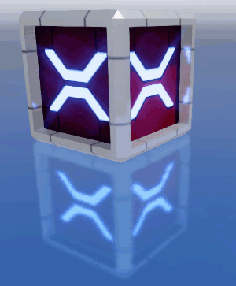

# Local reflections

Intermediate
Artist
Programmer

When **local reflections** are enabled, the scene is reflected in glossy [materials](../materials/index.md).

Local reflections dramatically increase the realism of a scene. Objects appear to be part of the world rather than having been Photoshopped in. 

Reflections are most obvious when they project bright spots onto other surfaces. The effect is especially striking in dark scenes, which have high contrast, and in conditions with lots of reflective surfaces and highlights.

Local reflections are a **screenspace effect**, which means they only reflect images that are already on the screen; they don't reflect objects that are off-screen or obscured by other objects. Put simply, if the camera can't see an object at that moment, then the object isn't reflected.

This means local reflections work well in enclosed areas such as corridors and rooms, but less well in open spaces. They work best on bumpy surfaces, which hide imperfections in the reflection. They work less well on very glossy, mirror-like surfaces, because you naturally expect these surfaces to reflect the whole world.

## Algorithm

Xenko processes local reflections in four passes:

1. The **raycast** pass performs screenspace ray tracing over the depth buffer to find intersections.
2. The **resolve** pass resolves the rays and calculates the reflection color.
3. The **temporal** pass uses the history buffer to blur constantly between the current and previous frames. This reduces noise in the reflection, but produces an animated "jittering" effect that is sometimes noticeable. You can adjust or disable this step to create the effect you want.
4. The **combine** pass mixes the results of the effect with the rendered image.

## Enable local reflections

To use local reflections, enable them in the **graphics compositor**.

1. In the **asset view** (in the bottom pane by default), double-click the **Graphics Compositor** asset.

    

    The graphics compositor editor opens.

    

2. Select the **post-processing effects** node.

    > [!Tip]
    > If there's no post-process effects node, right-click and select **Create > post-processing effects** to create one. On the new **forward renderer** node, on the **PostEffects** slot, click and drag a link to the **post-processing effects** node.
    
    > 

3. In the **property grid** (on the right by default), enable **Local reflections**.

    

After you enable local reflections, the scene is reflected in materials with the sufficient **glossiness threshold** (see below).

## Properties

### Raycast properties

#### BRDF bias

The reflection spread. Higher values provide finer, more mirror-like reflections. This setting has no effect on performance. The default value is `0.82`.

| BRDF: 0.6 | BRDF: 0.8 | BRDF: 1.0  
|---------------------|---------|---------
|  |  | 

#### Depth resolution

Downscales the depth buffer to optimize raycast performance. Full gives better quality, but half improves performance. The default is half.

#### Glossiness threshold

The amount of glossiness a material must have to reflect the scene. For example, if this value is set to `0.4`, only materials with a **glossiness map** value of `0.4` or above reflect the scene. The default value is `0.55`.

>[!Note]
>If the **Invert** check box is selected in the material **micro surface** properties, the opposite is true. For example, if the reflections glossiness value is set to `0.4`, only materials with a **glossiness map** value of less than `0.4` reflect the scene.

For more information about glossiness, see [Materials - geometry attributes](../materials/geometry-attributes.md).

#### Max steps 

The maximum number of raycast steps allowed per pixel. Higher values produce better results, but worse performance. The default value is `60`. 

>[!Note]
>This is the most important property for controlling performance.

#### Resolution

The raycast resolution. There are two options: **full** and **half**. Full gives better quality, but half improves performance. The default value is half.

#### Start bias

The offset of the raycast origin. Lower values produce more correct reflection placement, but produce more artefacts. We recommend values of `0.03` or lower. The default value is `0.01`.

| Start bias: 0.01 | Start bias: 0.1
|---------------------|---------
|   |   
| Larger gap between reflection and box (more correct) | Narrower gap between reflection and box (less correct)

### Resolve properties

#### Edge fade factor

The point at which the far edges of the reflection begin to fade. This has no effect on performance. The default value is `0.1`. 

| Edge fade factor: 0 | Edge fade factor: 0.5
|---------------------|---------
|   |    

#### Reduce highlights

Reduces the brightness of particularly bright areas of reflections. This has no effect on performance.

| Reduce highlights off | Reduce highlights on
|---------------------|---------
|   |    

#### Samples 

The number of rays xenko uses to resolve the reflection color. Higher values produce less noise, but worse performance. The default value is `4`.

#### Resolution 

Calculates reflection color using raycast results. There are two options: **full** and **half**. Full gives the best results, but half improves performance. The default value is **full**.

#### Use color buffer mips 

Downscales the input color buffer and uses blurred mipmaps when resolving the reflection color. This produces more realistic results by blurring distant parts of reflections in rough (low-gloss) materials. It also improves performance on most platforms. However, it uses more memory, so you might want to disable it on (for example) mobile platforms.

### Temporal properties

#### Temporal effect

Enables the temporal pass. This reduces noise, but produces an animated "jittering" effect that is sometimes noticeable. The temporal effect is enabled by default.

>[!Note]
>If the temporal effect is disabled, the other temporal properties have no effect.

#### Response

How quickly reflections blend between the reflection in the current frame and the history buffer. Lower values produce reflections faster, but with more jittering.   Note the visible jittering in the reflection below (using a response value of `0.1`):

 

If the camera in your game doesn't move much, we recommend values closer to `1`. The default value is `0.9`.

#### Scale

The intensity of the temporal effect. Lower values produce reflections faster, but more noise. The default value is `4`.

## See also

* [Materials](../materials/index.md)
* [Materials - geometry attributes](../materials/geometry-attributes.md)
* [Post effects](index.md)
* [Graphics compositor](../graphics-compositor/index.md)