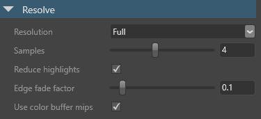

# Local reflections

Intermediate
Artist
Programmer

The **local reflections** effect reflects the scene in glossy [materials](../materials/index.md).

With local reflections, objects appear to be part of the world rather than having been placed arbitrarily. The effect gives objects a feeling of weight, and makes scenes feel more grounded.

Local reflections are most obvious when they project bright spots onto other surfaces. The effect is especially striking in night scenes, which have high contrast, and in conditions with lots of reflective surfaces and highlights.

Local reflections are a **screenspace effect**, which means they only reflect images that are already on the screen; they don't reflect objects that are off-screen or obscured by other objects. Put simply, if the player can't see an object at that moment, then the object isn't reflected.

This means local reflections work well in enclosed areas such as corridors and rooms, but less well in open spaces. They work best on bumpy surfaces, which hide imperfections in the reflection. They work less well on very glossy, mirror-like surfaces, because you naturally expect these surfaces to reflect the whole world.

## Enable local reflections

To use local reflections, enable them in the **graphics compositor**.

1. In the **asset view** (in the bottom pane by default), double-click the **Graphics Compositor** asset.

    

    The graphics compositor editor opens.

    

2. Select the **post-processing effects** node.

    > [!Tip]
    > If there's no post-process effects node, right-click and select **Create > post-processing effects** to create one. On the new **forward renderer** node, on the **PostEffects** slot, click and drag a link to the **post-processing effects** node.
    > 

3. In the **property grid** (on the right by default), enable the post effects you want to use and set their properties. For details about each post effect and its properties, see the pages below.

4. In the **property grid**, enable **Local reflections**.

    

## Reflection passes

Xenko processes local reflections in four passes:

1. The **raycast** pass ... 
2. The **resolve** pass resolves the rays and calculates the reflection color.
3. The **temporal** pass is optional. It uses the history buffer to blur constantly between the current and previous frames. This reduces jittering, but produces an animated effect that is sometimes noticeable.
4. The **combine** pass combines the results of the previous steps to create the final reflection.

## Properties

### Raycast properties

#### BRDF bias

The reflection spread. Higher values provide finer, more mirror-like reflections. Lower values produce more noise. The default value is `0.82`.

#### Depth resolution

Downscales the debuffer to optimize raycast performance based. Full gives better quality, but half, improves performance on most hardware. The default is half.

#### Glossiness threshold

The amount of glossiness a material must have to reflect the scene. For example, if this value is set to `0.4`, only materials with a **glossiness map** value of `0.4` or above reflect the scene. The default value is `0.55`.

>[!Note]
>If the **Invert** check box is selected in the material **micro surface** properties, the opposite is true. For example, if the reflections glossiness value is set to `0.4`, only materials with a **glossiness map** value of less than `0.4` reflect the scene.

For more information about glossiness, see [Materials - geometry attributes](../materials/geometry-attributes.md).

#### Max steps 

The maximum number of raycast steps allowed per pixel. Higher values affect performance; the default value is `60`.

#### Resolution

The raycast resolution. There are two options: **full** and **half**. Full gives better quality, but half improves performance on most hardware. The default value is half.

#### Start bias

The offset of the raycast origin. Lower values produce more correct reflection placement, but also produce more artefacts. We recommend values of `0.03` or lower. `0.01` is the default.

| Start bias: 0.03 | Start bias: 0.1
|---------------------|---------
|   |   
| Larger gap between reflection and box (more correct) | Narrower gap between reflection and box (less correct)

### Resolve properties

#### Edge fade factor

The point at which the far edges of the reflection begin to fade. The default value is `0.1`.

| Edge fade factor: 0 | Edge fade factor: 0.5
|---------------------|---------
|   |    

#### Reduce highlights

Reduces the brightness of particularly bright areas of reflection. This has no effect on performance.

| Reduce highlights off | Reduce highlights on
|---------------------|---------
|   |    

#### Samples 

The number of rays xenko uses to resolve the reflection color. Higher values produce less noise, but slower performance. The default value is `4`.

#### Resolution 

Calculates reflection color using raycast results. There are two options: **full** and **half**. Full gives the best results, but half is faster. The default value is full.

#### Use color buffer mips 

Downscales the input color buffer and uses blurred mipmaps when resolving the reflection color. This improves performance and produces more realistic results by blurring distant parts of reflections in rough (low-gloss) materials.

### Temporal properties

#### Temporal effect

Enables the temporal pass. This is enabled by default.

>![Note]
>If the temporal stage is disabled, the other temporal properties have no effect.

#### Response

How quickly the reflection appears in the material. Lower values produce reflections faster, but with more noise. The default value is `0.9`. 

#### Scale 

low values, more noise, less "movement" lag .

The default value is `4`.

## See also

* [Materials](../materials/index.md)
* [Materials - geometry attributes](../materials/geometry-attributes.md)