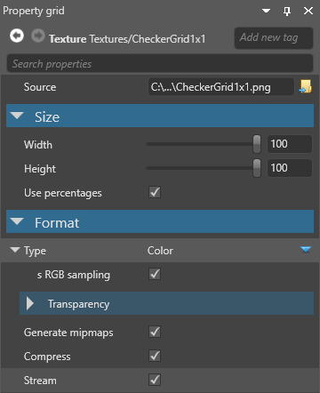

# Textures

Beginner
Artist
Programmer

**Textures** are images 

* 
used in [materials](materials.md). Xenko maps them to the surfaces the material covers.

Xenko uses textures in several ways, including:

* in a material used in a model in your game (for example as a brick pattern on a wall)
* image for other calculations (for example, to create normal maps)
* Use the image directly outside materials, such as drawing to the UI
* 

## Supported file types

Textures are created outside Game Studio in image editing programs such as Photoshop, then imported into Game Studio as assets.

The following file types can be used as textures:

* `.dds` 
* `.jpg` 
* `.jpeg`
* `.png`
* `.gif` 
* `.bmp` 
* `.tga` 
* `.psd` 
* `.tif`
* `.tiff`

> [!Note]
> * Xenko only imports the first frame of animated image files, such as animated gifs or PNGs. They don't animate in Xenko; they appear as static images.
> * Xenko currently doesn't support movie files.

## Add a texture

In the **asset view**, click **Add asset**. Select **Texture**, then select a template for the texture:

   * color
   * grayscale
   * normal map
   * render target

> [!Note]
> Render targets are a different kind of texture, and don't use images. For more information, see [Render targets](../graphics-compositor/render-targets.md).

Alternatively, drag the texture file from Explorer to the asset view:

Then select a texture template:
   

Game Studio adds the texture to the asset view:

## Texture properties

| Property         | Description
|------------------|---------
| Width            | The width of the texture as it's displayed in-game
| Height           | The height of the texture as it's displayed in-game
| Is size in percentage    | If selected, the width and height values are set to percentages. If cleared, they're set to percentages
| Width            | The width of the texture as it's displayed in-game
| Height           | The height of the texture as it's displayed in-game
| Type             | The texture type. Use **Color** for textures you want to display as images, **Greyscale** for ???, **Normal map** for normal maps.
| Generate mipmaps | If selected, Xenko generates mipmaps for the texture
| Compress         | If selected, Xenko compresses the final texture to a format based appropriate to the target platform. The final texture must be a multiple of 4

### Color texture properties

| Property | Description
|----------|---------
| sRGB sampling | If selected, the texture is stored in sRGB format and converted to linear space when sampled. We recommend you select this for all color textures, unless they're explicitly in linear space 
| Color key enabled | Use the color set in the **Color key color** property for transparency at runtime. If this isn't selected, the project uses transparent areas of the texture instead
| Color key color | The color used for transparency at runtime. This is only applied if **Color key enabled** is selected above
| Alpha | The texture alpha format (None, Mask, Explicit, Interpolated, or Auto)
| Premultiply alpha |  Premultiplies all color components of the images by their alpha component

### Normal map properties

| Property | Description
|----------|---------
| Invert Y | If selected, positive Y-component (green) face up in tangent space. This option depends on the tools you use to create normal maps

## Use textures

## Color textures

## Grayscale textures

## Normal map textures

## See also

* [Render targets](../graphics-compositor/render-targets.md)