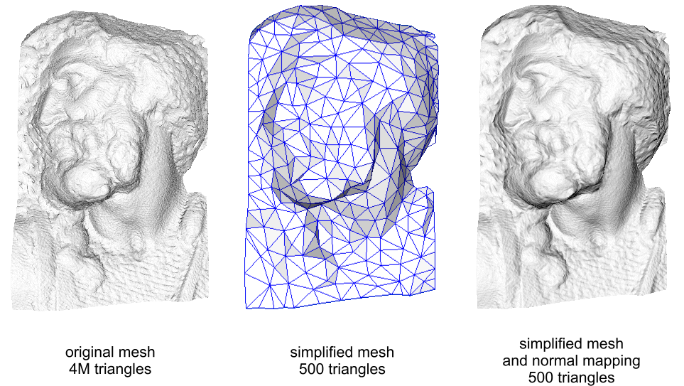

# Normal maps

**Normal maps** are textures that add the appearance of surface detail to materials.

These appear 

(Image courtesy of Paolo Cignoni, shared under [Attribution-ShareAlike 1.0 Generic (CC BY-SA 1.0)](https://creativecommons.org/licenses/by-sa/1.0/))

The left image shows a complex mesh of several million polygons. The right image shows a drastically simplified version of the same mesh, but with a normal map applied. The normal map contains information about how the mesh should reflect light, creating the illusion of much more complex geometry.

When used in combination with lighting they produce believable image which appears fully 3D even on a flat surface.

Normal maps usually represent small changes of the normal vector (the vector which points out of the surface). Xenko Game Studio uses the most common convention, that the X and Y components follow the tangent and the bitangent of the surface, and the Z component follows the normal vector of the surface. This means that a value of (0, 0, 1) will coincide with the normal vector and will represent no change, while a value of (-1, 0, 0) will be strongly tilted to the “left”, (“left” being negative X value in the tangent (local) space).

## Properties

In additional to the common texture settings, there are a couple of options you should pay attention to when importing normals.

If you plan to use a texture as a normal map, this should be set to Normal Map. This makes sure that the texture is assumed to be in linear color space and gets converted to a format suited for normals.

Format

* Compressed - Xenko will compress your texture in the most appropriate format for each platform. This will enforce some settings on the material side (see below). The compressed image will be unsigned, even if your input format is signed.

* As-is - Xenko will import the texture with the format you have supplied, as long as the target platform supports it.

## Add a normal map

## See also

* 
* Normal mapping ([Normal mapping (Wikipedia page)](http://en.wikipedia.org/wiki/Normal_mapping)) creates the appearance of bumps and indents in the mesh:
