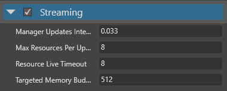

# Streaming

<span class="label label-doc-level">Beginner</span>
<span class="label label-doc-audience">Artist</span>
<span class="label label-doc-audience">Programmer</span>

As games typically contain lots of textures, it's usually better to **stream** them, so they load only when they're needed. This significantly decreases the time it takes to load a game or scene, uses less memory, and makes your game easier to scale.

>[!Note]
>Currently, only textures can be streamed.

## How Xenko streams textures

When streaming is enabled on a texture, Xenko only loads it when it's rendered in the scene.

When the texture is no longer needed, Xenko unloads it after a time you specify in the global streaming settings.

Currently, there's no loading priority for textures. For example, Xenko doesn't load textures based on distance; instead, Xenko loads them all in sequence.

### Using streaming with mipmaps

If mipmaps are enabled in the [texture properties](index.md), when Xenko streams the texture, Xenko loads a low-quality mipmap, then loads higher-quality mipmaps based on the distance from the camera.

The gif below shows this process happening in slow motion. In most situations, streaming mipmaps happens much more quickly; however, the process can still be noticeable.


If mipmaps are disabled, Xenko only loads the texture at its original quality. This means the texture is invisible until it loads, which can cause pop-in effects. For this reason, we recommend you enable mipmaps for textures when using streaming.

## When **not** to use streaming

Streaming is enabled by default for all textures. You might want to disable streaming on important textures you always want to display immediately and in high quality, such as:

* [splash screens](../../game-studio/splash-screen.md)

* textures on player models

* textures used in [particles](../../particles/index.md) (particles often have a short lifespan, so might disappear before the texture loads)

## Enable or disable streaming on a texture

1. In the **asset view**, select the texture.

    

2. In the **property grid**, under **Format**, use the **Stream** check box.

    

## Global streaming settings

You can access the global streaming settings in the Game Settings asset. These settings apply to all textures that have streaming enabled.

For instructions about how to access the global streaming settings, see the [Game Settings](../../game-studio/game-settings.md) page.

### Properties



| Property             | Description
|----------------------|------------
| Streaming            | Enable streaming
| Update interval | How frequently Xenko updates the streaming
| Max resources per update | The maximum number of textures updated per update. Higher numbers reduce pop-in but slow the framerate.
| Resource timeout (milliseconds)| How long resources stay loaded after they're no longer used (after the **memory budget** is exceeded)
| Memory budget (in MB) | When the memory used by streaming exceeds this budget, unused resources are removed

## Control streaming in code

To disable streaming for a single texture:

```cs
var texture = Content.Load<Texture>("myTexture", ContentManagerLoaderSettings.StreamingDisabled);
```

### Access the streaming manager

Use [Streaming](xref:SiliconStudio.Xenko.Streaming).

For example, to enable streaming globally, use:

```cs
Streaming.EnableStreaming = true;
```

To start streaming a texture, use:

```cs
Streaming.StreamResources(myTexture);
```

### StreamingOptions

There are three [StreamingOptions](xref:SiliconStudio.Xenko.Streaming.StreamingOptions):

#### KeepLoaded

The `KeepLoaded` option keeps the texture in memory even if the memory budget is exceeded.

For example:

```cs
var myOptions = new StreamingOptions() { KeepLoaded = true };
Streaming.StreamResources(myTexture, myOptions);
```

#### Change the StreamingOptions at runtime

Use `SetResourceStreamingOptions`. For example:

```cs
var myNewOptions = new StreamingOptions() { KeepLoaded = false };
Streaming.SetResourceStreamingOptions(myTexture, myNewOptions);
```

#### Disable streaming globally

Use:

```cs
((Game)Game).Streaming.DisableStreaming = true;
```

## See also

* [StreamingManager API](xref:SiliconStudio.Xenko.Streaming.StreamingManager)
* [Textures index](index.md)
* [Texture compression](compression.md)
* [Game Settings](../../game-studio/game-settings.md)