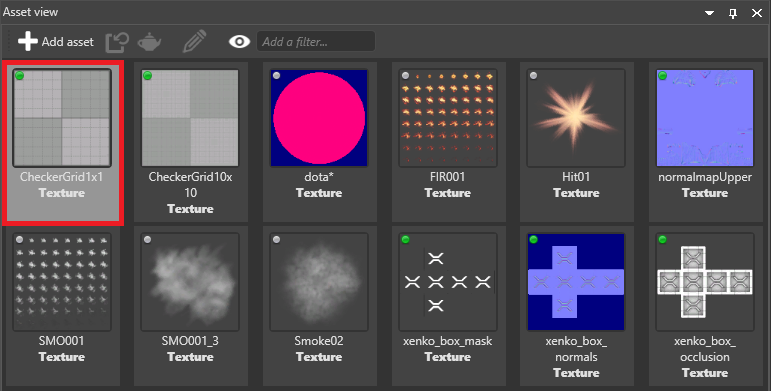

# Streaming

<span class="label label-doc-level">Beginner</span>
<span class="label label-doc-audience">Artist</span>
<span class="label label-doc-audience">Programmer</span>

>[!Note]
>Currently, only textures can be streamed.

As games typically contain lots of textures, it's usually better to **stream** them, so they load only when they're needed. This: 

* significantly decreases the time it takes to load a game or scene

* uses less memory

* makes your game easier to scale

## How Xenko streams textures

When streaming is enabled on a texture, Xenko only loads it when it's rendered in the scene.

There's no loading priority for textures. For example, Xenko doesn't load textures based on distance. Instead, Xenko loads them all in sequence.

If mipmaps are enabled in the [texture properties](index.md), when the texture is needed at runtime, Xenko loads the lowest-quality version of the texture, then upscales it based on the distance from the camera. The gif below shows this process happening in slow motion; in most situations on most hardware, streaming happens much more quickly.


When the texture is no longer needed, Xenko downscales it, then unloads it.

If mipmaps are disabled, Xenko only loads the texture at its original quality. This means the texture is invisible until it loads in full, which can cause noticeable pop-in effects.

## When not to use streaming

Streaming is enabled by default for all textures. You might want to disable streaming on important textures you always want to display immediately and in high quality, such as:

* [splash screens](../../game-studio/splash-screen.md)

* textures on player characters

* textures used in [particles](../../particles/index.md) (particles often have a short lifespan, so might disappear before the texture fully loads)

## Enable or disable streaming on a texture

1. In the **asset view**, select the texture.

    

2. In the **property grid**, under **Format**, use the **Stream** check box.

    

## Disable streaming for a single texture in code

Use:

```cs
((Game)Game).Streaming.StreamResourcesFully(myTexture);
```

To disable streaming on a texture and load it in code, use:

```cs
var texture = Content.Load<Texture>("myTexture", ContentManagerLoaderSettings.StreamingDisabled);
```

## Disable all texture streaming

To override all texture settings and disable streaming globally, use:

```cs
((Game)Game).Streaming.DisableStreaming = true;
```

## StreamingManager API

To change streaming settings such as the lifespan of streamed textures or streaming efficiency, see the [StreamingManager API](xref:SiliconStudio.Xenko.Streaming.StreamingManager).

## See also

* [StreamingManager API](xref:SiliconStudio.Xenko.Streaming.StreamingManager)
* [Textures index](index.md)
* [Texture compression](compression.md)