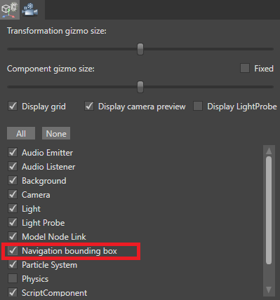

 # Navigation bounding boxes

Beginner
Level designer
Programmer

**Navigation bounding boxes** define the area that [navigation meshes](navigation-meshes.md) cover. You can use them to create smaller navigation areas in your scene, rather than having a mesh cover the entire scene.

The scene editor displays the bounding box as a blue outline.

 

## Create a navigation bounding box

To create a navigation bounding box, add a navigation bounding box component to an entity.

1. In the scene, select the entity you want to contain the bounding box, or create a new entity.

2. With the entity selected, in the **property grid**, click **Add component** and select **Navigation bounding box**. 

    

    Game Studio adds a navigation bounding box to the entity.

3. Under the **Navigation bounding box** component properties, use the **XYZ** values to set the size of the bounding box.

    

4. Use the entity's **transform component** to position the bounding box in your scene.

## Show or hide the bounding box in the scene editor

In the scene editor toolbar, open the **gizmo options** menu and use the **Navigation bounding box** checkbox.

| Bounding box hidden | Bounding box shown (note blue box outline) 
|----------------------|------------
|| 

## See also

* [Navigation groups](navigation-groups.md)
* [Navigation meshes](navigation-meshes.md)
* [Navigation components](navigation-components.md)
* [Dynamic navigation](dynamic-navigation.md)