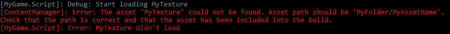

# Logging

<span class="label label-doc-level">Intermediate</span>
<span class="label label-doc-audience">Programmer</span>

You can **log** information about your game while it runs. Unlike [profiling](profiling.md), which retrieves information automatically, it's up to you to create your own log messages and define when they're triggered in your code. 

For example, you can create a message to be logged when a certain texture runs and another message to be logged when the texture doesn't run. This is useful for investigating how your game is performing.

## Write a log message

In the script you want to log, write:

```cs
Log.MyLogLevel("My log message");
```

Where `MyLogLevel` is the severity level you want to use for the log message (see below).

You can combine this with `if` statements to log this message under certain conditions (see **Example script** below).

## Log levels

There are six levels of log message, used for different levels of severity.

| Log level | Color | Description
|-----------|-------|-----
| <font color="#A9A9A9">Debug</font> | Gray | For...
| Verbose | White | For...
| <font color="#90EE90">Info</font> | Green | For...
| <font color="#FFD700">Warning</font> | Yellow | For minor errors
| <font color="#FF6347">Error</font> | Red |For more serious errors
| <font color="#FF6347">Fatal</font> | Red | For serious errors that crash the game

When you use logging and run your game in debug mode, Xenko opens a console in a second window to display logging information. The messages are color-coded by level.



By default, the log displays log messages for the **Info** level and above. You won't see **Debug** or **Verbose** messages. To change this, see **Set the minimum log level** below.

The name of the module (such as the script containing the log message) is given in brackets. This is followed by the log level (eg **Warning**, **Error**, etc), then the log message. 

>[!Note]
>The console displays log messages from all modules, not just your own scripts. For example, it also displays messages from the @'SiliconStudio.Core.Serialization.Contents.ContentManager'.

If you run your game from Visual Studio, log messages are also shown in the Visual Studio **Output** window.

### Set the minimum log level

You can set a minimum log level to display. For example, if you only want to see messages as severe as **Warning** or higher, use:

```cs
Log.ActivateLog(LogMessageType.Warning);
```

>[!Note]
>This isn't a global setting. The log level you set only applies to the script you set it in.

>[!Note]
>If you don't specify a log level, the log displays log messages for the **Info** level and above. You won't see **Debug** or **Verbose** messages.

## Print debug text

You can print debug text at runtime. You can use this, for example, to display a message when a problem occurs.

>[!Note]
>Debug text is automatically disabled when you build the game in release mode.

In the `Update` method of your script, add:

```cs
DebugText.Print("My debug text",new Int2(x: 50, y: 50));
```

Where `x` and `y` are the pixel coordinates to display the text at.

The debug message is displayed when you run the game.


>[!Note]
>Currently, you can't change the font or color of the debug text.

### Disable debug text

In the script, add:

```cs
DebugText.Enabled = false;
```

>[!Note]
>Debug text is automatically disabled when you build the game in release mode.

## Example script

The following script checks that the texture `MyTexture` is loaded. When the texture loads, the log displays a debug message (`Log.Error`). When it doesn't load, the log records an error message (`Log.Debug`) and the game displays the debug text "MyTexture not loaded" (`DebugText`).

```cs
using System.Linq;
using System.Text;
using System.Threading.Tasks;
using SiliconStudio.Core.Diagnostics;
using SiliconStudio.Core.Mathematics;
using SiliconStudio.Xenko.Input;
using SiliconStudio.Xenko.Engine;
using SiliconStudio.Xenko.Graphics;

namespace MyGame
{
    public class Script : SyncScript
    {
		public Texture myTexture;

        public override void Start()
        {
            // Initialization of the script.

            Log.ActivateLog(LogMessageType.Debug);
            Log.Debug("Start loading MyTexture");

            myTexture = Content.Load<Texture>("MyTexture");
            if (myTexture == null)
            {

                Log.Error("MyTexture not loaded");
            }
            else
            {

                Log.Debug("MyTexture loaded successfully");
            }
        }

        public override void Update()
        {
			if(myTexture == null)
                DebugText.Print("MyTexture not loaded",new Int2(x: 50, y: 50));
        }
    }
}
```

## See also

* [Profiling](profiling.md)