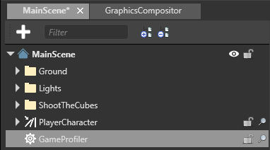
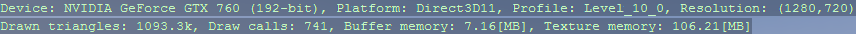

## Profiling

<span class="label label-doc-level">Beginner</span>
<span class="label label-doc-audience">Programmer</span>

You can **profile** your project to check its runtime performance and find problems. Use the Xenko **GameProfiler** script or an external profiling tool such as the Performance Profiler in Visual Studio.


## Profile with the Xenko **GameProfiler** script

The **GameProfiler** script shows how performance costs change at runtime. This helps isolate the bottlenecks and find their root cause.

You can profile your project by adding a script to your scene.

1. In the **asset view**, click  and select **Scripts > Game Profiler**.

 

2. The **New script dialog** opens. Leave the default information and click **Create script**.

    

    Game Studio adds the GameProfiler script to your project.

3. If Game Studio asks you to save the script, click **Save**.

4. Save the project.

5. Reload the assemblies.

6. Drag the **GameProfiler** script from the Asset view to the **entity tree**. It doesn't matter where.

    Game Studio adds the **GameProfiler** as an entity to your scene.

    

7. Select the **GameProfiler** entity. 

8. In the **property grid** (on the right by default), enable the **Game Profiler** component.

    

    >[!Tip]
    >You can also enable and disable the profiler at runtime with **Left Ctrl + Left Shift + P**.

9. Run the game.

    The Game Profiler results profiling results as your game runs.

    

    >[!Note]
    >Game Profiler disables VSync. This gives you the true profiling values, ignoring sync time.

### Game Profiler properties


| Property | Description
| -------- | --------
| Filter | The kind of information the profiler displays (FPS only, CPU, or GPU). At runtime, change with **F1 / F2 / F3**.
| Refresh time (ms) | How frequently the profiler gets and displays new results. At runtime, control with **- / +**.
| Display page | The results page displayed. At runtime, switch pages with the number keys.
| Sort by | by time/ by name
| Text color | The color of the text displayed in the profiler
| Priority | See [Scheduling and priorities](../scripts/scheduling-and-priorities.md)

### Understanding the Game Profiler results

The top row displays information about the current display mode and basic performance.


* `Display`: the current profiler mode (FPS only, CPU, or GPU)
* `Frame`: the current frame
* `Update`: the average time (ms) taken to update the game since the profiler last refreshed
* `Draw`: the average time (ms) taken to render the frame since the profiler last refreshed
* `FPS`: the number of frames rendered per second since the profiler last refreshed

If you select **GPU** (**F3**) as the mode, the profiler displays:



* `Total`: the amount of memory used since the profiler last refreshed
* `Peak`: the peak memory use since the game started
* `Last allocations`: the amount of memory used or freed since the profiler last refreshed

If you select **CPU** as the mode (**F3**), the profiler displays:


* `Device`: the graphics device (manufacturer's description)
* `Platform`: the currently executed platform (eg DirectX, OpenGL, Vulkan, etc)
* `Profile`: the feature level for your game, set in **Game Settings > Rendering**. For more information, see [Game settings](../game-studio/game-settings.md)
* `Resolution`: the game resolution.

In the **GPU** and **CPU** modes, the profiler displays information about the parts of the code being profiled.


Column  | Description
--------|--------
`AVG/FRAME` | ?
`AVG/CALL` | avg time taken to run the key
`MIN/CALL` | the shortest amount of time taken to run the key (since...?) 
`MAX/CALL` | the longest amount of time taken to run the key (since... ?)
`CALLS/FRAME` | the number of times the key was called per frame 
`MARKS/FRAME` | ?
`PROFILE KEY` | The part of the code (such as a function or script) being profiled. This column also displays additional information depending on the context, such as the number of entities affected.

### Game Profiler runtime controls

You can change the Game Profiler settings at runtime using keyboard shortcuts.

Action  | Control
--------|--------
Left Ctrl + Left Shift + P  | Enable/disable the profiler
- / +  | Slow down / speed up the refresh time
F5 / F6 | Page back / page forward
Number keys | Jump to a page
F4 | Toggle between sorting by profile key and time

### Use the Game Profiler in code

Enable the Game Profiler:

```cs
Profiler.EnableProfiling();
```

Enable the Game Profiler only for the profiler keys you specify:

```cs
Profiler.EnableProfiling(true, {mykey1,mykey2});
```

Enable profiling only for the profiler keys you specify:

```cs
Profiler.EnableProfiling(false, {mykey1,mykey2});
```

Profile a script (and nothing else):

```cs
MyScript.ProfilingKey
```

## Use external profiling tools

Instead of using the Xenko Game Profiler, you can use external profiling tools to profile your project.

| Profiler | Type | Platforms
| ---- | ---- | -----
| [Visual Studio profiler](https://msdn.microsoft.com/en-us/library/mt210448.aspx) | Visual Studio feature | Desktop and mobile 
| [Xamarin Profiler](https://www.xamarin.com/profiler) | Standalone tool distributed with Xamarin Studio | Mobile 
| [RenderDoc](https://renderdoc.org/builds) | Standalone | Desktop and mobile

### Use the Visual Studio profiler

Visual Studio has powerful in-built profiling tools that can identify common performance issues.

1. In Visual Studio, open your project solution (`.sln`) file.

2. To open the profiler, press **Alt + F2**, or in the task bar click **Analyze > Performance Profiler**.

    

3. In the **Profiler** window, select the profiling tools you want to run.

    

    You can run multiple profiling tools at once.

4. To launch the profiler, in the Performance Profiler tab, at the bottom, click **Start**.
   
   
    
    Visual Studio runs your application and begins profiling.

For more information about the Visual Studio profiler, see the [MSDN documentation](https://msdn.microsoft.com/en-us/library/mt210448.aspx).

## Common bottlenecks

As CPU and GPU process different types of data, it's usually easy to identify which part is causing a bottleneck.

Most GPU problems arise when the application uses expensive rendering techniques, such as post effects, lighting, shadows, and tessellation. To identify the problem, disable rendering features.

If instead there seems to be a CPU bottleneck, reduce the complexity of the scene.

For graphics:

* decrease the resolution of your game
* reduce the quality of your [post effects](../graphics/post-effects/index.md)
* reduce the number of lights and size of [shadow maps](../graphics/lights-and-shadows/shadows.md)
* reduce shadow map sizes
* use culling techniques to reduce the number of objects and vertices rendered

For textures:

* use [compressed textures](../graphics/textures/compression.md) on slower devices
* use sprite sheets, not individual images
* use texture atlases, not separate textures