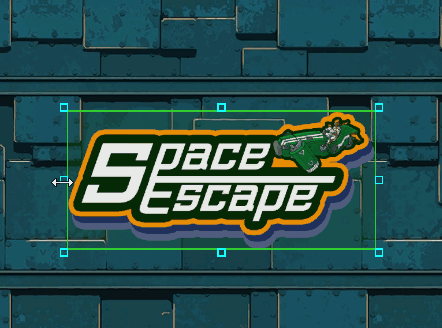
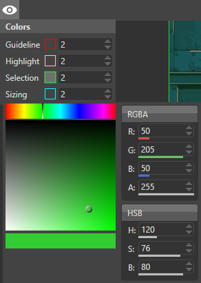
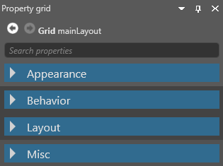

# UI editor

Beginner
Artist
Designer

You can edit [UI pages](ui-pages.md) and [UI libraries](ui-libraries.md) with the **UI editor**.

To open the editor, in the **asset view**, double-click a **UI page** or **[UI library](ui-libraries.md)**.

The UI editor opens.

The UI editor comprises:

* the list of [UI libraries](ui-libraries.md) (**A**), which contain the elements (such as buttons and grids) you can add to your UI

* a visual tree of the elements in the UI page (**B**)

* a preview of the UI page as it appears in the game (**C**)

* a property grid (**D**) to edit the properties of your UI elements

## UI libraries

A **UI library** contains **UI elements** (such as grids, buttons, sliders and so on) that you can use and re-use in your UI pages. They work similarly to [prefabs](../game-studio/prefabs/index.md) in the scene editor.

For more information, see [UI libraries](ui-libraries.md).

## Visual tree

The **visual tree** shows the elements in the UI page and their hierarchy. This is similar to the **entity tree** in the scene editor.

The number in parentheses indicates the number of children an element has. Some elements, such as buttons, can only have one child.

To re-order elements in the visual tree, drag and drop them.

To move an element to a new group, right-click the element and select **Group into**. For example, to create a new grid and move an element into it, right-click the element and select **Group into > Grid**.

## UI preview

The **UI preview** displays a preview of the UI as it appears at runtime. The rendering is equivalent to the rendering in the game, assuming the design resolution is the same as the UI component that uses the edited asset (see [UI Asset properties](#ui-asset-properties)).

By default, the UI is a **billboard**, meaning it always faces the camera. The UI view camera is **orthographic** (see [Cameras](../graphics/cameras.md)). 

You can select, move, and resize elements in the preview as you do in image editing applications.

### Controls

| Action            | Control                              
|-------------------|--------------------------------------
| Pan               | Hold middle mouse button + move mouse
| Zoom              | Mouse wheel                    
| Speed up pan/zoom | Hold shift while panning or zooming

### Tool options

To change the color and size of the selection tools, in the **UI editor toolbar**, click 

> [!Note]
> These options have no effect on how the UI is displayed at runtime.

* **Guideline**: changes the width of the lines that indicate the distance to the margins (in pixels)

* **Highlight**: changes the width of the highlight that appears when you move your mouse over an element

* **Selection**: changes the width of the selection highlight

* **Sizing**: changes the size of the boxes at the edges of selections used to resize elements

## Add a UI element to a UI page

To add an element (such as a grid or button), drag it from the **UI library** to the UI page or the **visual tree**.

## Properties

You can view and edit element properties in the **property grid**.

Properties are sorted by **Appearance**, **Behavior**, **Layout** and **Misc**.

### Appearance

Commonly used properties include `BackgroundColor`, `Opacity`, `Visibility` and `ClipToBounds`.

### Behavior

Commonly used properties include whether the element responds to touch events(`CanBeHitByUser`).

### Layout

Commonly used properties include the size of the element (`Height`, `Width` and `Depth`), its alignment (`HorizontalAlignment`, `VerticalAlignment`, `DepthAlignement`) and its `Margin`.

### Misc

This category contains only the `Name` of the element.

## See also

* [UI pages](ui-pages.md)
* [UI libraries](ui-libraries.md)
* [Add a UI to a scene](add-a-ui-to-a-scene.md)
* [Layout system](layout-system.md)