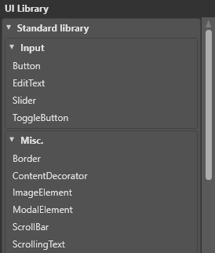
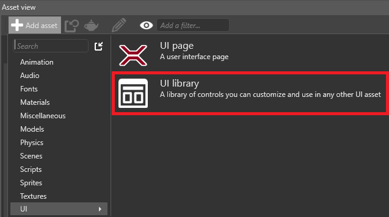
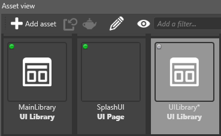
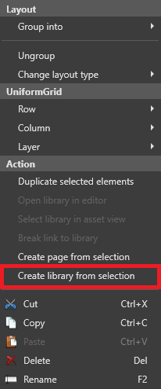

# UI libraries

<span class="label label-doc-level">Beginner</span>
<span class="label label-doc-audience">Artist</span>
<span class="label label-doc-audience">Designer</span>

**UI libraries** contain **UI elements** (such as grids, buttons, sliders and so on) that you can use and re-use in your [UI pages](UI-pages.md). All Xenko projects include the **standard library** of UI elements, but you can create your own libraries of custom elements too.



UI libraries are similar to [prefabs](../game-studio/prefabs/index.md) in the scene editor; you can create your own elements, save them in a custom UI library, and then use them wherever you need across multiple UI pages. You can also nest libraries inside other libraries, just like [nested prefabs](../game-studio/prefabs/nested-prefabs.md).

At runtime, you can re-instantiate UI library roots and insert them into an existing UI tree.

## Create a UI library

In the **asset view**, click **Add asset > UI > UI library**.



Game Studio adds the UI library to the asset view.



### Create a UI library from a UI element

1. Select the element or elements.

2. Right-click and select **Create library from selection**.



Game Studio creates a library with a copy of the element(s) you selected.

## Assign a UI library in code

```cs
// This property can be assigned from a UI library asset in Game Studio
public UILibrary MyLibrary { get; set; }

public Button CreateButton()
{
    // assuming there is a root element named "MyButton" of type (or derived from) Button
    var button = MyLibrary.InstantiateElement<Button>("MyButton");

    // if there is no root named "MyButton" in the library or the type does not match,
    // the previous method will return null
    if (button != null)
    {        
        // attach a delegate to the Click event
        someButton.Click += delegate
        {
            // do something here...
        };
    }

    return button;
}
```

UI pages have only one root element. UI libraries can have multiple root elements.

## See also

* [UI pages](ui-pages.md)
* [UI editor](ui-editor.md)
* [Add a UI to a scene](add-a-ui-to-a-scene.md)
* [UI scripts](ui-scripts.md)
* [Layout system](layout-system.md)