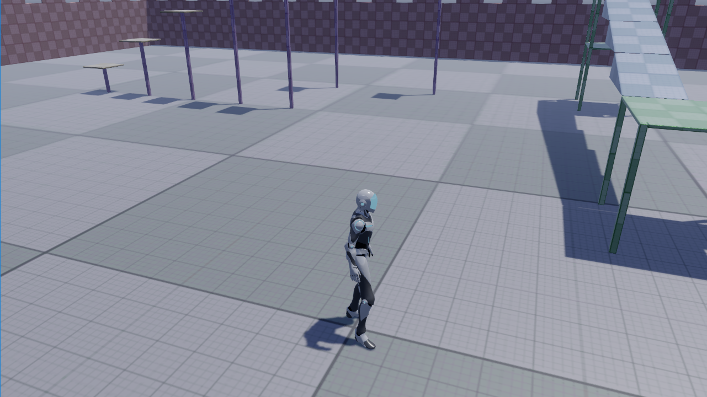
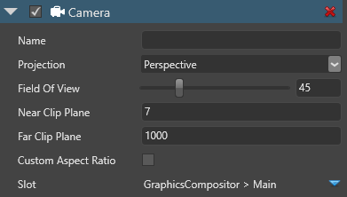

# Cameras

**Cameras** capture your scene and display it to the player. Without cameras, you can't see anything in your game. You can have an unlimited number of cameras in your scene.

## Create a camera in Game Studio

In the scene editor, right-click and select **Camera**, then choose the kind of camera you want to create (**perspective** or **orthographic**).

## Perspective and orthographic cameras

**Perspective cameras** provide a "real-world" perspective of the objects in your scene. In this view, objects close to the camera appear larger, and lines of identical lengths appear different due to foreshortening, as in reality. Perspective cameras are most used for games that require a realistic perspective, such as third-person and first-person games.

With **orthographic cameras**, objects are always the same size, no matter how far their distance from the camera. Parallel lines never touch, and there's no vanishing point. Orthographic cameras are most used for games with top-down or isometric perspectives, such as strategy and 4X games.

| Perspective  | Orthographic
|--------------|------------
| | 

### Field of view (perspective mode only)

When the camera is set to **perspective** mode, the **field of view** changes the camera frustum, and has the effect of zooming in and out of the scene. At high settings (90 and above), the field of view creates stretched "fish-eye lens" views. The default setting is 45.

| Field of view: 45 (default) | Field of view: 90
|-----------------------------|------------------
| | 

### Orthographic size (orthographic mode only)

When the camera is set to **orthographic** mode, the **orthographic size** has the effect of zooming in and out.

| Orthographic size: 10 (default) | Orthographic size: 50
|-----------------------------|------------------
| | 

## Near and far planes

The near and far planes determine where the camera's view begins and ends.

The **near plane** is the closest point the camera can see. The default setting is 0.1. Objects before this point aren't drawn.

Xenko renders the area between the near and far planes.

| Near plane 0.1 (default); far plane: 50  | Near plane: 7; far plane 1000 (default)
|--------------------|------------------
|  | 

The **far plane**, also known as the draw distance, is the furthest point the camera can see. Objects beyond this point aren't drawn. The default setting is 1000.

## Camera properties

| Property            | Description                                       
|---------------------|--------------------------------------------------
| Projection          | The type of projection used by the camera (perspective or orthographic)
| Field of view       | The vertical field of view used for perspective projection (in degrees)
| Orthographic size   | The height of the orthographic projection (the orthographic width is automatically calculated based on the target ratio). This has the effect of zooming in and out
| Near clip plane     | The nearest point the camera can see
| Far clip plane      | The furthest point the camera can see
| Custom aspect ratio | If selected, use a custom aspect ratio you specify.  Otherwise, automatically adjust the aspect ratio to the render target ratio
| Custom aspect ratio | The aspect ratio for the camera (when the **Custom aspect ratio** option is selected)
| Slot                | The camera slot used in the graphics compositor. For more information, see [Camera slots](camera-slots.md)

## Camera scripts

You can control cameras using **camera scripts**. Xenko includes some camera script templates. 

### Add a camera script in Game Studio

1. In the **asset view** (in the bottom by default), click **Add asset > Scripts** and choose the camera script you want to add.

    

2. In the **scene editor**, select the entity with the camera you want to control.

    , click **Add component** and select the camera script you want to use.

    

    Game Studio adds the camera script to the entity.

For more information about how to create and use scripts, see [Scripts](../scripts/index.md).

## Camera targets
