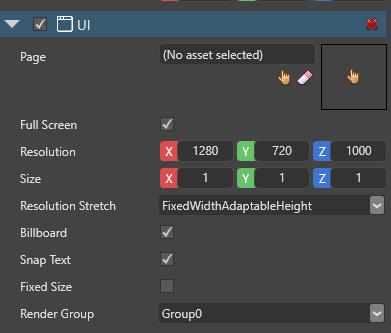

# Add a UI

After you create a UI page, add it to the scene as a component.

1. In the **scene editor**, create an empty entity. To do this, right-click the scene and select **Empty entity**.

    

2. In the property grid (on the right by default), click **Add component** and select **UI**.

    

    Game Studio adds a **UI component** to the entity.

    

3. Next to **Page**, click  (**Pick an asset up**).

    The **asset picker** opens.

    

4. Select the UI page you want to add and click **OK**. 

    For information about how to create and edit UI pages, see [Editor]...

5. 

YOU USUALLY WANNA DISABLE UI WHILE USING SCENE EDITOR
BUT REMEMBER TO RE-ENABLE IT

## UI component properties

## UI script


note - if you disable billboard mode, text is broken

we recommend you always use full screen as other stuff is broken

fixed size is broken


## UI pages

A **UI page** is a collection of UI elements. A UI page is equivalent to a scene, and UI elements to entities in a scene. Elements can have parents and children, just like entities. Like scenes, each UI scene opens in its own tab.

### Create a UI page

In the **asset view**, click **Add asset > UI > UI page**.


Game Studio adds the UI page to the asset view.


### Assign a UI page

You can assign a UI page to the `Page` property of a UI component.

```cs
// This property can be assigned from a UI page asset in Game Studio
public UIPage MyPage { get; set; }

protected override void LoadScene()
{
    InitializeUI();
}

public void InitializeUI()
{
    var rootElement = MyPage.RootElement;
    // to look for a specific element in the UI page, extension methods can be used
    var button = rootElement.FindVisualChildOfType<Button>("buttonOk");

    // if there's no element named "buttonOk" in the UI tree or the type doesn't match,
    // the previous method returns null
    if (button != null)
    {
        // attach a delegate to the Click event
        button.Click += delegate
        {
            // do something here...
        };
    }

    // assign the page to the UI component
    var uiComponent = Entity.Get<UIComponent>();
    uiComponent.Page = MyPage;
}
```
