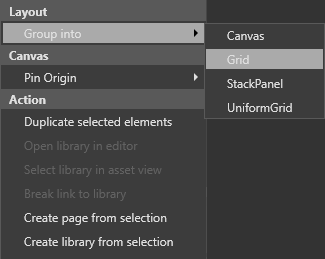
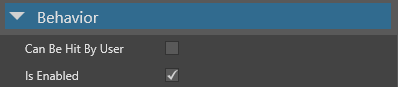

# UI editor

Beginner
Artist
Designer

With the **UI editor**, you can create and edit UIs for your game.

The UI editor comprises:

* the list of [UI libraries](ui-libraries.png) (**A**), which contain the elements you can add to your UI

* a visual tree of the elements in the UI page (**B**)

* a preview of the UI as it appears in the game (**C**)

* a property grid (**D**) to edit the properties of your UI elements

There are two type of UI asset: `UIPageAsset` and `UILibraryAsset`. Their runtime counterparts are `UIPage` and `UILibrary` respectively.

## Open the UI editor

In the **asset view**, double-click a **UI page** or **UI library** to open it in the UI editor.

## UI libraries

A **UI library** contains **UI elements** (such as grids, buttons, sliders and so on) that you can use and re-use in your UI pages. They work similarly to [prefabs](../game-studio/prefabs.md) in the scene editor.

For more information, see [UI libraries](ui-libraries.md).

## Visual tree

The **visual tree** shows the elements in the UI page and their hierarchy. This is similar to the **entity tree** in the scene editor.

The number of children an element has is indicated after its name in parentheses. Some elements, such as buttons, can only have one child.

You can drag and drop elements inside the visual tree to re-order them.

### Move an element to a new group

Right-click the element and select **Group into**.

For example, to create a new grid and move an element into it, right-click the element and select **Group into > Grid**.

## Add a UI element

To add an element, drag it from the **UI library** to the UI page or the **visual tree**.

* Layout category

  * *Ungroup*: all children of the selected panel will be move to its parent

  * *Change layout type*: the selected panel type will be change to another panel type (e.g. from a Grid to a UniformGrid)

## UI preview

The **UI preview** displays a preview of the UI as it appears at runtime. The rendering is equivalent to the rendering in the game, assuming the design resolution is the same as the UI component that uses the edited asset (see [UI Asset properties](#ui-asset-properties)).

The UI view camera is orthographic (see [Cameras](../graphics/cameras.md). By default, the UI always faces the camera (ie the UI is a **billboard**).

You can select, move, and resize elements in the preview as you do in image editing applications.

### Controls

| Action            | Control                              
|-------------------|--------------------------------------
| Pan               | Hold middle mouse button + move mouse
| Zoom              | Mouse wheel                    
| Speed up pan/zoom | Hold shift while panning or zooming

### Tool options

To change the color and size of the selection tools, in the **UI editor toolbar**, click 

> [!Note]
> These options have no effect on how the UI is displayed at runtime.

* The **Guideline** 

* The **Selection** value changes the width of the selection highlight.

* The **Sizing** value changes the size of the boxes...

## Properties

You can view and edit element properties in the **property grid** (on the right by default). Properties are sorted by **Appearance**, **Behavior**, **Layout** and **Misc**.

### Appearance

Commonly used properties include `BackgroundColor`, `Opacity`, `Visibility` and `ClipToBounds`.

### Behavior

Commonly used properties include whether the element responds to touch events(`CanBeHitByUser`).

### Layout

Commonly used properties include the size of the element (`Height`, `Width` and `Depth`), its alignment (`HorizontalAlignment`, `VerticalAlignment`, `DepthAlignement`) and its `Margin`.

### Misc

This category contains only the `Name` property.

## UI pages

A **UI page** is a collection of UI elements (such as a menu).

In terms of organization, a UI page is equivalent to a scene, and UI elements are equivalent to to entities in a scene. Elements can have parents and children, just like entities. Each UI scene opens in its own tab.

### UI asset properties

You can change the resolution used at design time in the UI asset properties (for both UI pages and UI libraries). This is the equivalent of the UI component `Resolution` property.

To edit the value, click the **UI properties** button in the UI editor. 

Alternatively, select the UI asset in the **asset view**.